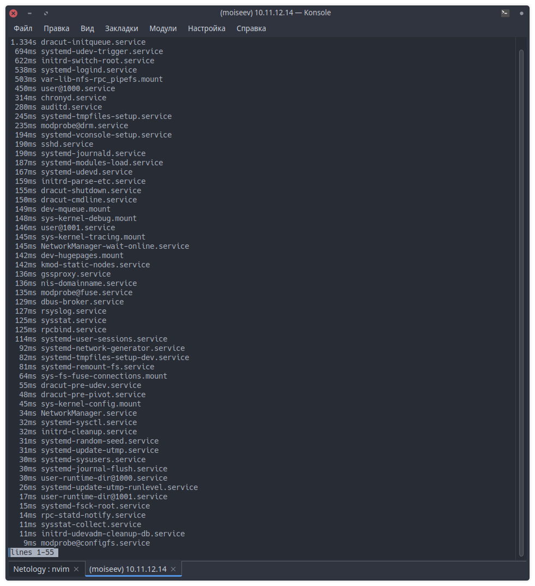
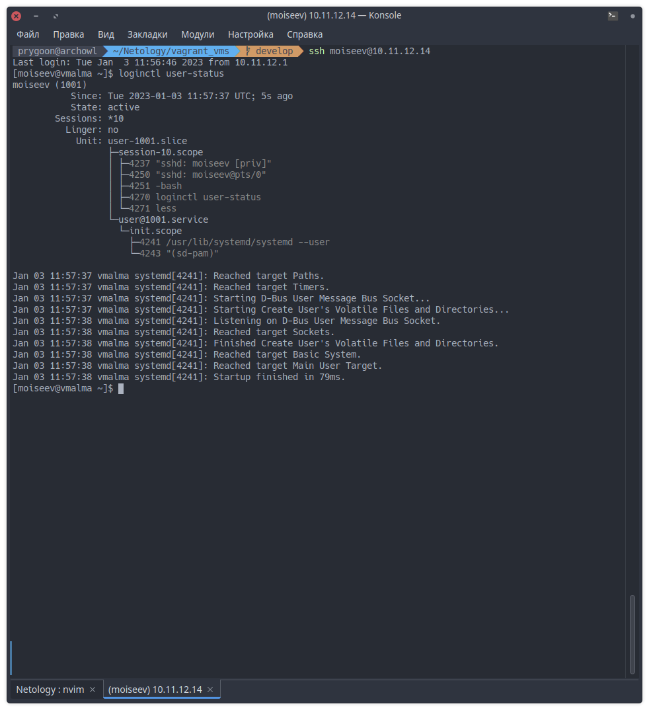
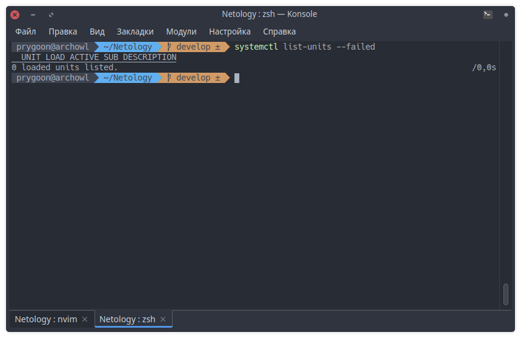

# Домашнее задание к занятию "Инициализация системы, Init, systemd"

### Задание 1.

Выполните systemd-analyze blame.

*Модули, которые загружаются дольше всего.*  
```console
1.334s dracut-initqueue.service
 694ms systemd-udev-trigger.service
 622ms initrd-switch-root.service
 538ms systemd-logind.service
 503ms var-lib-nfs-rpc_pipefs.mount
 450ms user@1000.service
 314ms chronyd.service
 280ms auditd.service
 245ms systemd-tmpfiles-setup.service
 235ms modprobe@drm.service
```

 
---

### Задание 2.

Какой командой вы посмотрите ошибки ядра, произошедшие начиная со вчерашнего дня?

```bash 
journalctl -k -p 3 -S yesterday -U now
```

---

### Задание 3.

Запустите команду loginctl user-status.
  
Утилита `loginctl` предназначена для управления сеансами пользователей. С помощью нее можно получить информацию о том, какие пользователи находятся в системе в данный момент, о длительности сессии пользователя, его процессах и т.д.  
Команда `loginctl user-status` показывает информацию о пользователе, который вызвал эту команду и несколько последних записей из журнала. 

---

### Задание 4.

Есть ли у вас на машине службы, которые не смогли запуститься? Как вы это определили?

Служб, которые не смогли запуститься нет, определил с помощью команды `systemctl list-units --failed`.

  

---


