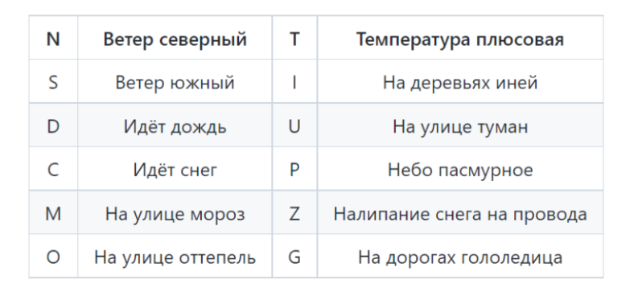

# Домашнее задание к занятию "Использование логических операций"

### Задание 1. Построение таблиц истинности

Постройте таблицы истинности для следующих примеров:

- !(a ∨ b ∧ с) ∧ (a ∧ b)
- !a ∨ !c ∧ !b
- a ∧ b ∧ c ∨ d
- !(a ∧ !b ∧ c)
- !(a ∨ b) ∨ c  

Создано скриптом `lazy_scripts/task2_1.c`
a|b|c|d|Func1|Func2|Func3|Func4|func5
:-:|:-:|:-:|:-:|:-:|:-:|:-:|:-:|:-:
0|0|0|0|0|1|0|1|1
0|0|0|1|0|1|1|1|1
0|0|1|0|0|1|0|1|1
0|0|1|1|0|1|1|1|1
0|1|0|0|0|1|0|1|0
0|1|0|1|0|1|1|1|0
0|1|1|0|0|1|0|1|1
0|1|1|1|0|1|1|1|1
1|0|0|0|0|1|0|1|0
1|0|0|1|0|1|1|1|0
1|0|1|0|0|0|0|0|1
1|0|1|1|0|0|1|0|1
1|1|0|0|0|0|0|1|0
1|1|0|1|0|0|1|1|0
1|1|1|0|0|0|1|1|1
1|1|1|1|0|0|1|1|1

------

### Задание 2. Определите, каким выражением может быть Func

Создано скриптом `lazy_scripts/task2_2.go`
a|b|c|d|e|f|Func
-|-|-|-|-|-|----
1|1 | 0 | 0 | 0 | 0 | 0
1|0 | 1 | 0 | 0 | 1 | 0
1|0 | 0 | 1 | 0 | 0 | 0

- (b ∧ d) ∨ (d ∧ f) ∨ (f ∧ b)

------
### Задание 3. Составьте логические выражения

Даны выражения:

 
Составьте и запишите на языке алгебры логики (используя логические операции) следующие выражения:
- «На улице мороз, небо пасмурное, но снег не идёт»;  
$\ M \land P \land \lnot C$ 
- «На улице температура плюсовая и туман или на деревьях иней»;  
$\ (T \land U) \lor I$
- «На улице северный ветер или идёт снег, и на улице мороз»;  
$\ (N \lor C) \land M$
- «На дорогах нет гололедицы, но при этом дует северный ветер, мороз, снег налипает на провода»;  
$\ \lnot G \land N \land M \land Z$
- «На улице оттепель или на деревьях иней, при этом температура плюсовая, или небо ясное».  
$\ (O \lor I) \land (T \lor \lnot P)$

------

