# Домашнее задание к занятию «Виртуализация и облачные решения: AWS, GCP, Yandex Cloud, OpenStack»

---

## Задание 1

Чем частное облако отличается от общедоступного, публичного и гибридного?

Частное облако — объединяет в себе службы облачных
вычислений, предоставляемые по интернету или по частной
внутренней сети не всем, а только определённым пользователям
Преимущество частного облака — высокая безопасность
Недостаток — ИТ-отдел компании несёт ответственность за
стоимость и подотчётность, касающиеся управления частным
облаком.

Общественное облако — вид инфраструктуры, которая
распределяется между несколькими организациями из
определённого сообщества с общими интересами

- Может находиться в совместной собственности, управлении и
эксплуатации этих организаций или третьей стороны
- Может физически существовать как внутри, так и вне
юрисдикции владельца.

Публичное облако — инфраструктура,
предназначенная для свободного использования широкой
публикой.

- Публичное облако может находиться в собственности,
управлении и эксплуатации коммерческих, научных и
правительственных организаций или их комбинации
- Публичное облако физически существует в юрисдикции
владельца — поставщика услуг.

Гибридное облако — вычислительная система, в которой
используются все разновидности виртуальных сред
Добавление в инфраструктуру традиционных ИТ-ресурсов
позволяет построить гибридную ИТ-модель, которая обладает
преимуществами:

- цены общедоступного облака
- общая гибкость облачных вычислений
- безопасность выделенного оборудования

---

## Задание 2

Что обозначают: IaaS, PaaS, SaaS, CaaS, DRaaS, BaaS, DBaaS, MaaS, DaaS, NaaS, STaaS? Напишите примеры их использования.

- IaaS (Infrastructure as a Service) - это модель облачных вычислений, которая предоставляет инфраструктуру (вычислительные мощности, хранилища данных, сети и т.д.) в качестве услуги. Это позволяет пользователям арендовать вычислительные ресурсы, не приобретая их самостоятельно. Примеры IaaS-провайдеров: IBM Softlayer, Hetzner Cloud, Microsoft Azure, Amazon EC2, GigaCloud.

- PaaS (Platform as a Service) - это модель облачных вычислений, которая предоставляет платформу для разработки, тестирования и развертывания приложений в качестве услуги. Это позволяет разработчикам создавать приложения без необходимости управления инфраструктурой. Примеры PaaS-провайдеров: Google App Engine, IBM Bluemix, Microsoft Azure, VMWare Cloud Foundry.

- SaaS (Software as a Service) - это модель облачных вычислений, которая предоставляет приложения в качестве услуги. Пользователи могут получить доступ к приложению через Интернет, не устанавливая его на своем устройстве. Примеры SaaS-провайдеров: Dropbox, GoogleDoc.

- CaaS (Containers as a Service) - это модель облачных вычислений, которая предоставляет контейнеры (например, Docker-контейнеры) в качестве услуги. Контейнеры предоставляют среду, в которой приложения могут запускаться и работать без привязки к определенной инфраструктуре. Примеры CaaS-провайдеров: Amazon Elastic Container Service, Google Kubernetes Engine, Microsoft Azure Container Instances.

- DRaaS (Disaster Recovery as a Service) - это модель облачных вычислений, которая предоставляет резервное копирование и восстановление данных в случае сбоя или катастрофы. Это позволяет организациям быстро восстанавливать свои системы и данные. Примеры DRaaS-провайдеров: IBM Cloud Disaster Recovery, VMware vCloud Availability и UCloud.

- BaaS (backup as a service) - это модель облачных вычислений, которая предоставляет резервное копирование и восстановление данных в качестве услуги. Клиенты могут хранить свои данные в облаке провайдера BaaS и в случае необходимости восстановить их. Примеры BaaS-провайдеров: Amazon S3 Glacier, Microsoft Azure Backup, Veeam Cloud Connect.

- DBaaS (Database as a Service) - это модель облачных вычислений, которая предоставляет базы данных в качестве услуги. Это позволяет пользователям создавать, управлять и масштабировать базы данных без необходимости устанавливать и настраивать их самостоятельно. Примеры DBaaS-провайдеров: Amazon RDS, Google Cloud SQL, Microsoft Azure SQL Database.

- MaaS (Monitoring as a Service) - это модель облачных вычислений, которая предоставляет мониторинг и управление инфраструктурой и приложениями в качестве услуги. Это позволяет организациям отслеживать состояние своей инфраструктуры и приложений и реагировать на проблемы быстрее. Примеры MaaS-провайдеров: Datadog, New Relic, Nagios.

- DaaS (Desktop as a Service) - это модель облачных вычислений, которая предоставляет виртуальные рабочие столы в качестве услуги. Это позволяет пользователям получать доступ к рабочему столу и приложениям из любого устройства с доступом в Интернет. Примеры DaaS-провайдеров: Amazon WorkSpaces, Microsoft Azure Virtual Desktop, VMware Horizon Cloud.

- NaaS (Network as a Service) - это модель облачных вычислений, которая предоставляет сетевую инфраструктуру (маршрутизаторы, коммутаторы, брандмауэры и т.д.) в качестве услуги. Это позволяет пользователям создавать и управлять сетями без необходимости покупать и устанавливать оборудование. Примеры NaaS-провайдеров: Cisco Meraki, Aryaka, AT&T Network on Demand.

- STaaS (Storage as a Service) - это модель облачных вычислений, которая предоставляет хранилище данных в качестве услуги. Это позволяет пользователям хранить и управлять данными без необходимости покупать и устанавливать физические устройства хранения. Примеры STaaS-провайдеров: Google Drive, Dropbox, Яндекс.Диск.

---

## Задание 3

Напишите, какой вид сервиса предоставляется пользователю в ситуациях:

1. Всеми процессами управляет провайдер - SaaS.
2. Вы управляете приложением и данными, остальным управляет провайдер. - PaaS
3. Вы управляете операционной системой, средой исполнения, данными, приложениями, остальными управляет провайдер. - IaaS
4. Вы управляете сетью, хранилищами, серверами, виртуализацией, операционной системой, средой исполнения, данными, приложениями. - никакой сервис не предоставляется.

---

## Задание 4

Выполните действия и приложите скриншоты по каждому этапу:

1. Создать платёжный аккаунт:

   - зайти в консоль:

    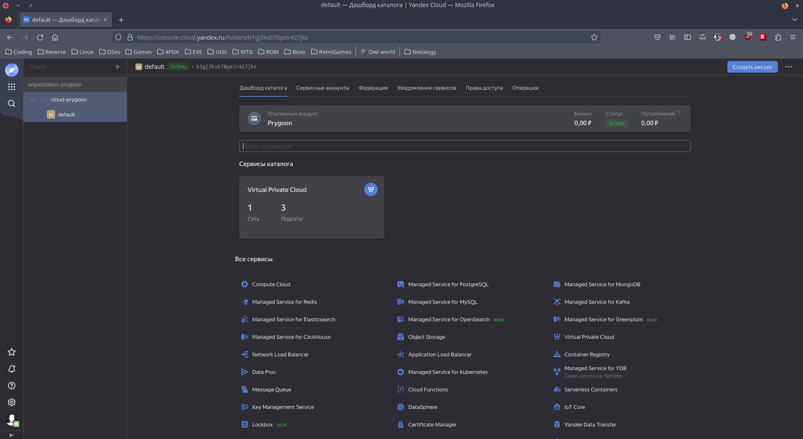

   - выбрать меню биллинг:

    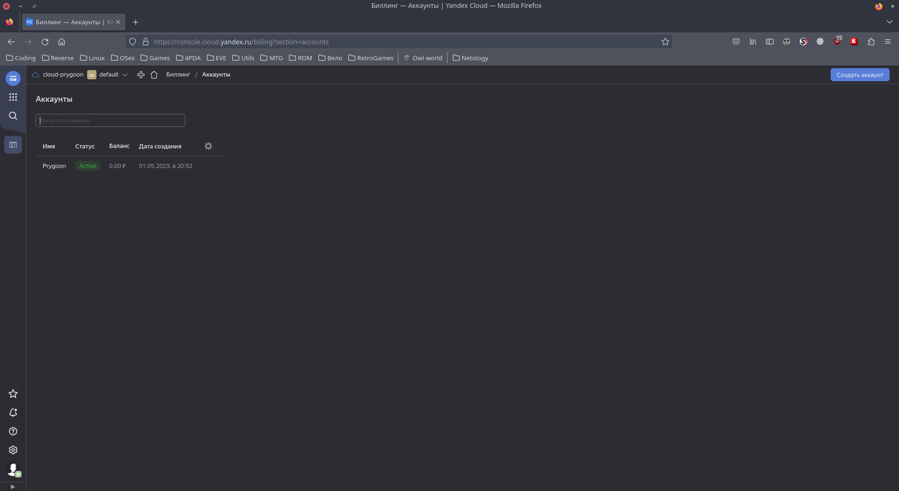

   - зарегистрировать аккаунт:

    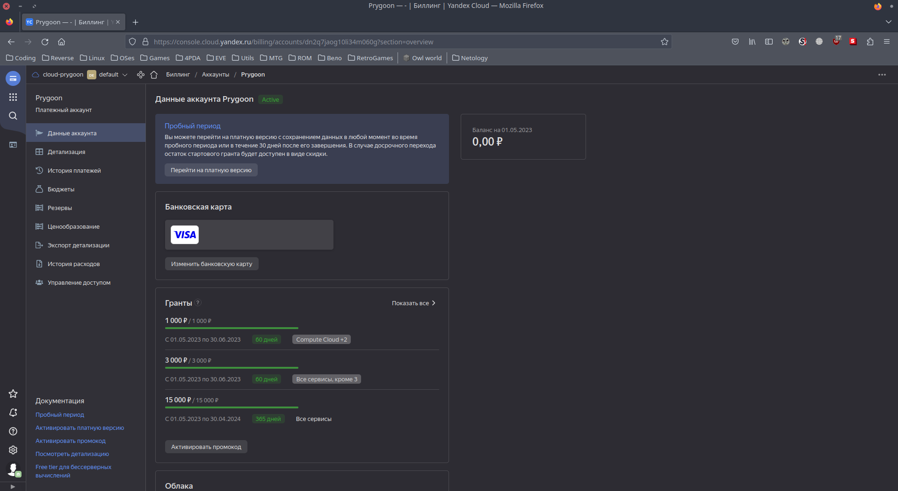

2. После регистрации выбрать меню в консоли Computer cloud.
3. Приступить к созданию виртуальной машины.

   1. Какие ОС можно выбрать?

        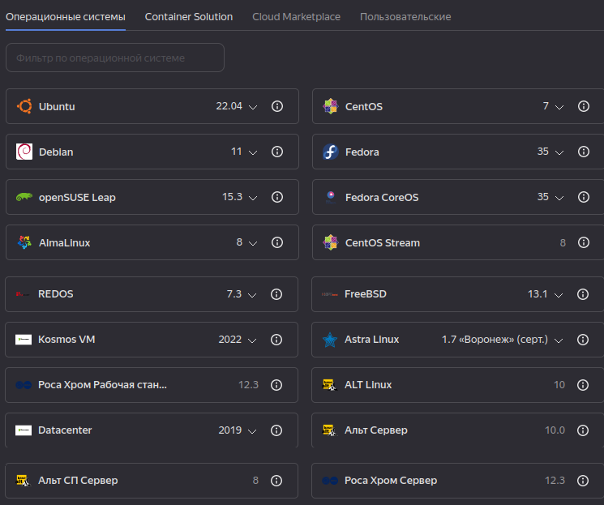

   2. Какие параметры сервера можно выбрать?

        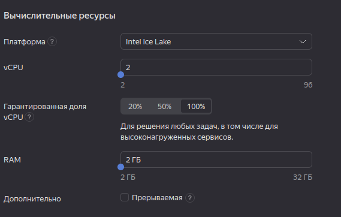

   3. Какие компоненты мониторинга можно создать?

        - Не сразу нашёл, так как можно создать только для ОС Ubuntu и Debian.

        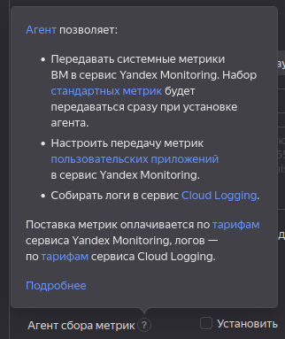

   4. Какие системы безопасности предусмотрены?

        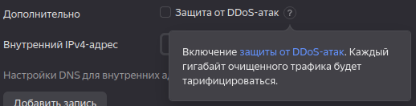

   5. Как меняется цена от выбранных характеристик? Приведите пример самой дорогой и самой дешёвой конфигурации.

        - Самая дорогая, с учётом лицензий на ПО:

        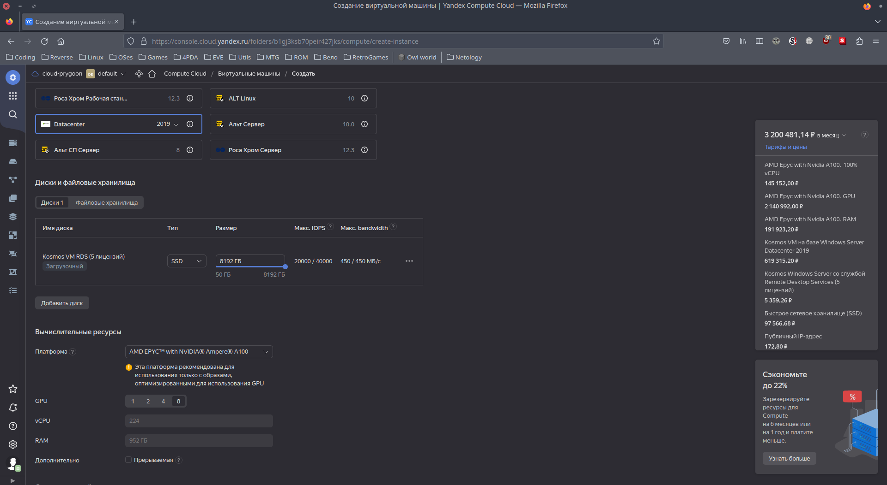

        - Самая дешёвая:

        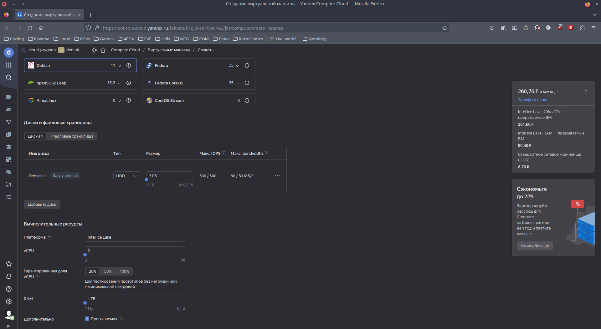

---

## Дополнительные задания* (со звёздочкой)

---

### Задание 5*

Выполните действия и приложите скриншот:

1. Создайте виртуальную машину на Yandex Cloud.
2. Создайте сервисный аккаунт.
3. Отсканируйте SSH-ключ.
4. Придумайте логин.
5. Подключитесь к облаку через SSH.

    Создал:

    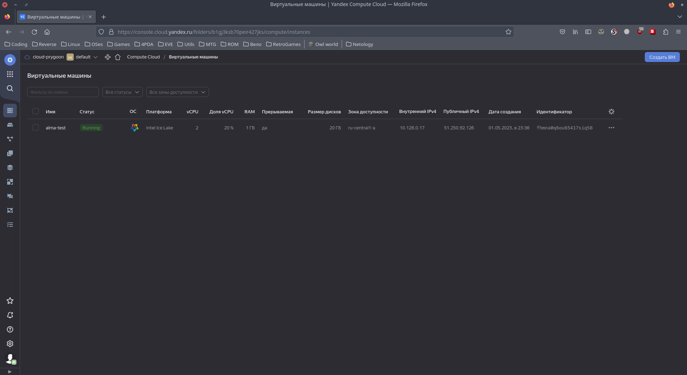

    Подключился:

    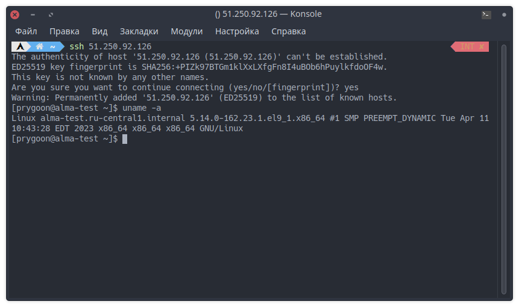
