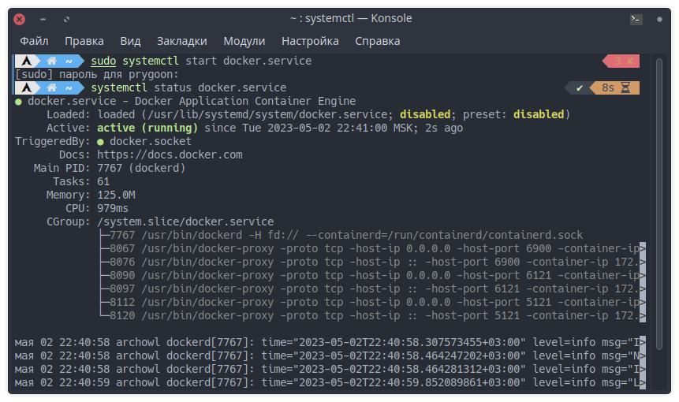
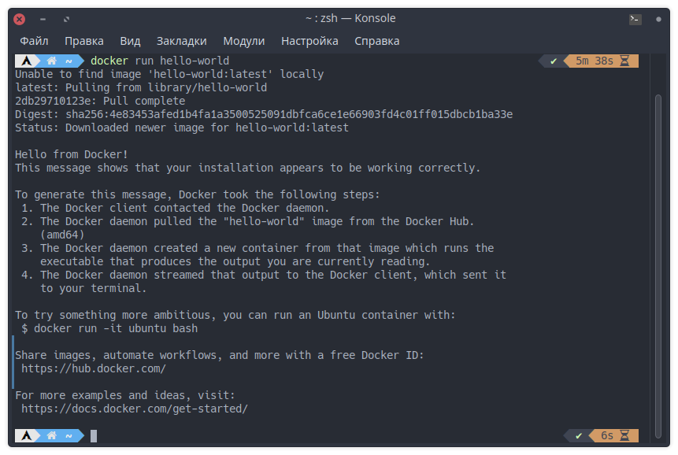
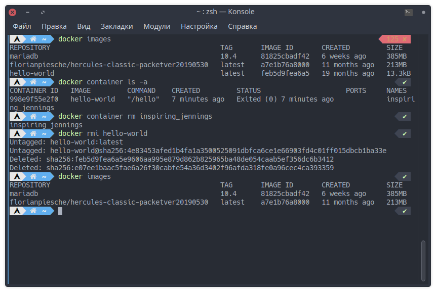
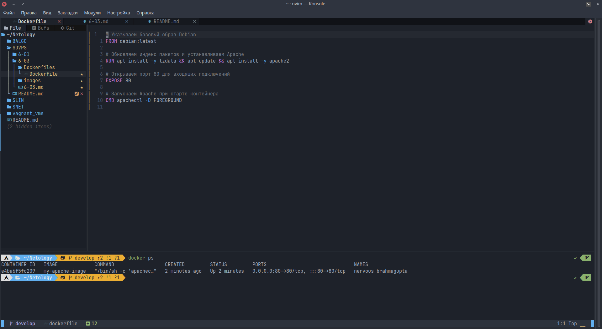
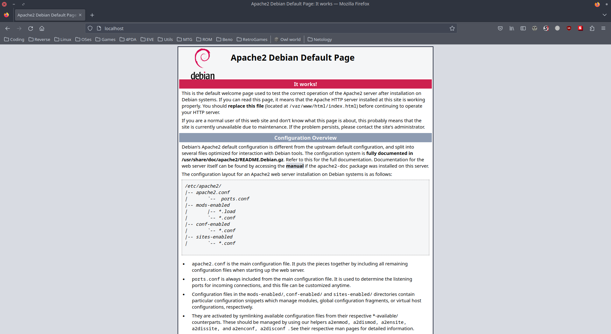
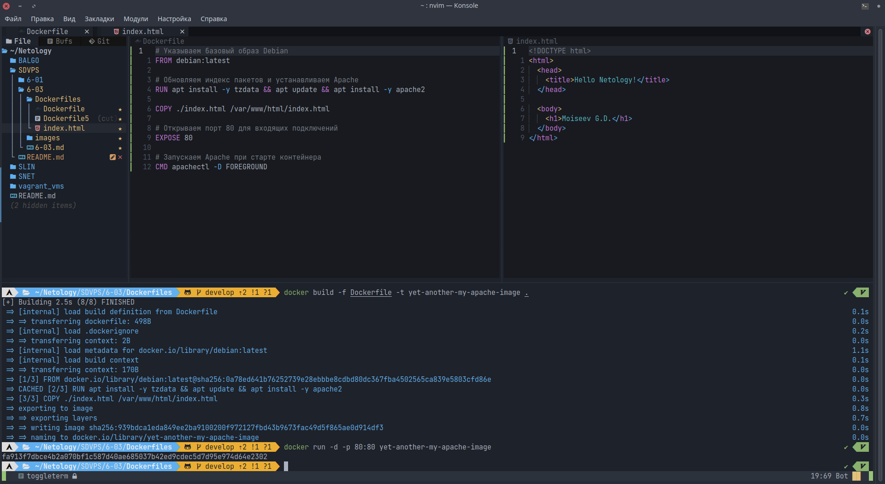
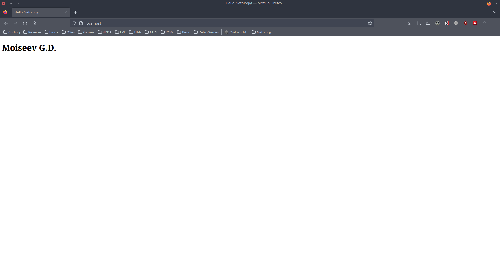

# Домашнее задание к занятию «Docker. Часть 1»

---

## Задание 1

Чем контейнеризация отличается от виртуализации?

Контейнеризация и виртуализация - это два разных подхода к управлению приложениями и ресурсами, используемым на серверах и в облачной инфраструктуре. Они имеют несколько существенных отличий.

- Виртуализация создает виртуальную машину, которая эмулирует аппаратное обеспечение на физическом сервере. Каждая виртуальная машина имеет свою собственную операционную систему и работает независимо от других виртуальных машин на том же сервере.Каждая виртуальная машина занимает значительный объем ресурсов, таких как процессор, память и диск.

- Контейнеризация использует виртуализацию на уровне операционной системы для создания изолированных контейнеров, в которых могут запускаться приложения. Каждый контейнер содержит все необходимые библиотеки, зависимости и файлы приложения, но использует общую операционную систему с другими контейнерами на том же сервере. Это позволяет использовать ресурсы сервера более эффективно, поскольку каждый контейнер требует гораздо меньше ресурсов, чем виртуальная машина. Кроме того, контейнеры легче и быстрее запускаются и масштабируются, что делает контейнеризацию более гибкой и удобной для развертывания приложений в облачной инфраструктуре.

---

## Задание 2

1. Установите Docker.
   - На моей домашней и рабочей, а также на Raspbery Pi и арендованном VPS уже установлен докер.
2. Приложите скриншот.

   

---

## Задание 3

1. Запустите образ hello-world.
2. Приложите скриншот.

   

---

## Задание 4

1. Удалите образ hello-world.
2. Приложите скриншот.

   

---

## Дополнительные задания\* (со звёздочкой)

Их выполнение необязательное и не влияет на получение зачёта по домашнему заданию. Можете их решить, если хотите лучше разобраться в материале.

---

## Задание 5\*

1. Найдите в Docker Hub образ apache и установите его.
1. Приложите:

- скриншоты сетевых настроек вашей виртуальной машины

  - запускал на локалхосте

- скриншоты работающих контейнеров;

   

- скриншот браузера, где вы открыли дефолтную страницу вашего apache внутри контейнера.

   

---

## Задание 6\*

1. Создайте свой Docker образ с Apache2 и подмените стандартную страницу index.html на страницу, содержащую ваши ФИО.
1. Приложите:

- скриншот содержимого Dockerfile;

   

- скриншот браузера, где apache2 из вашего контейнера выводит ваши ФИО.

   
