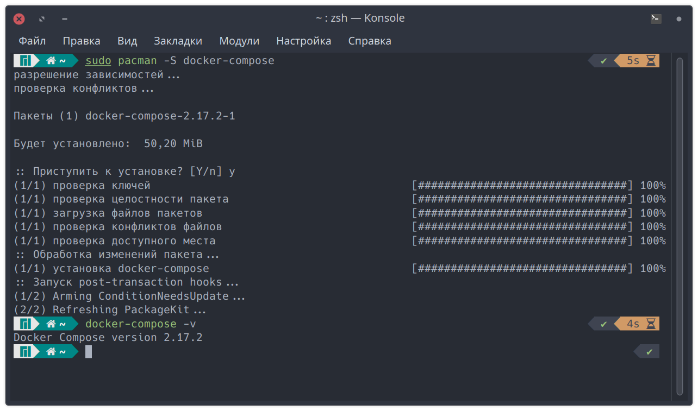
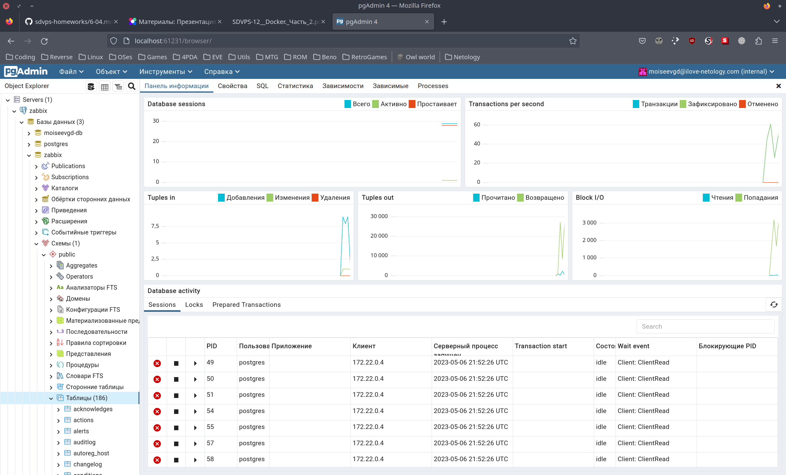
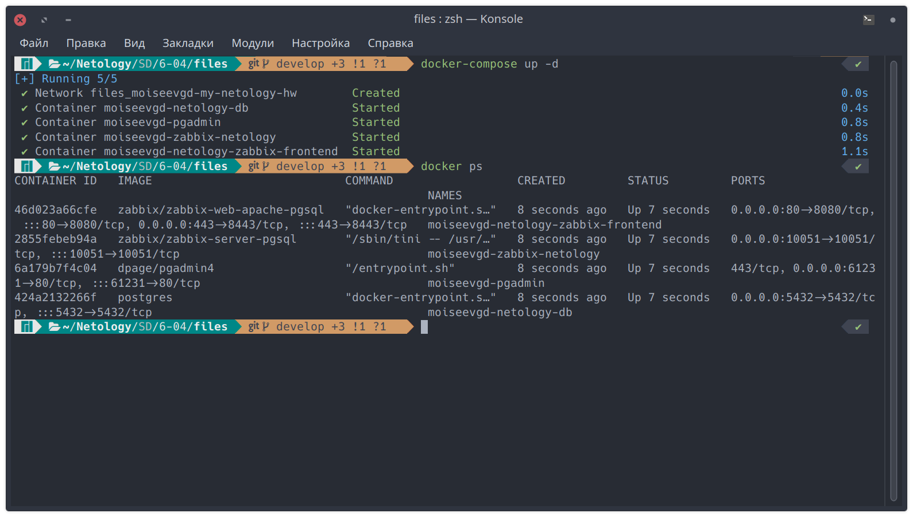
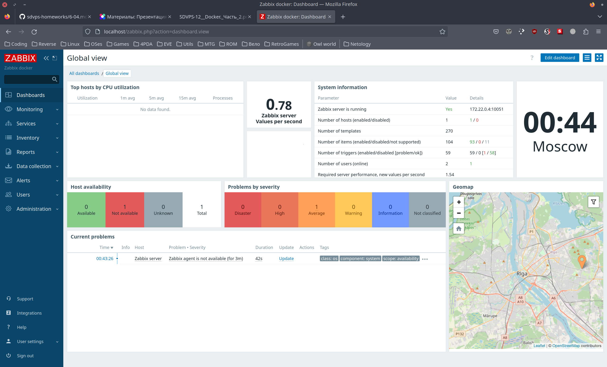
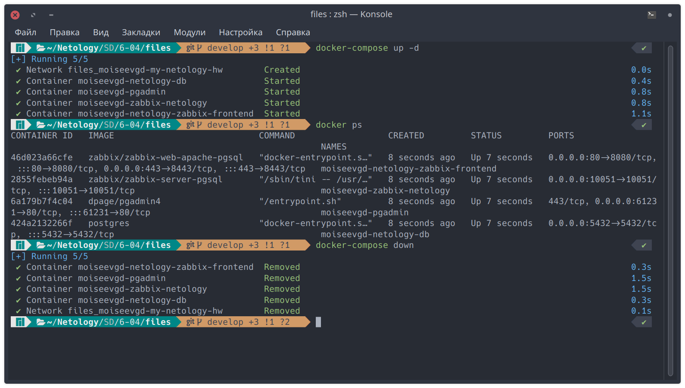
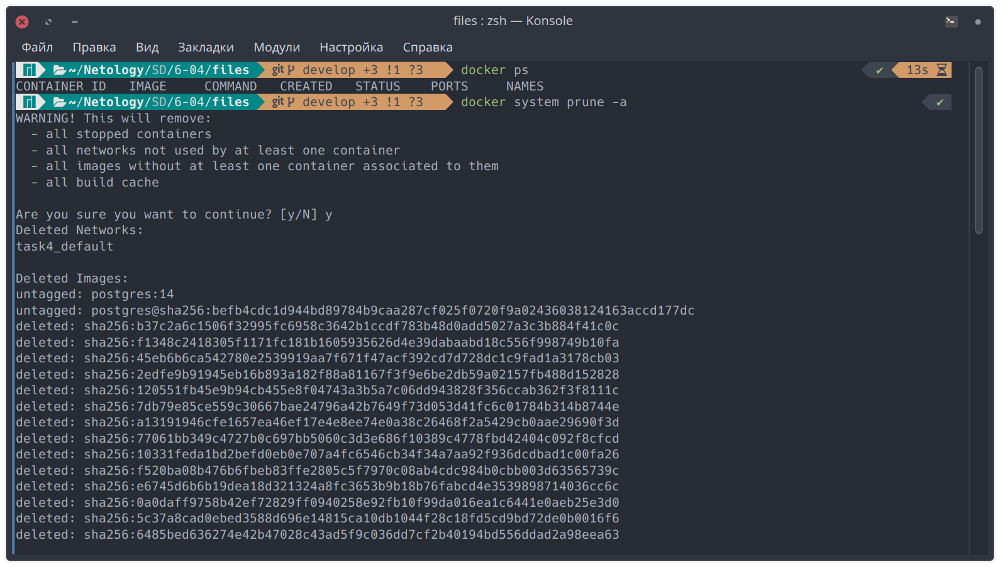
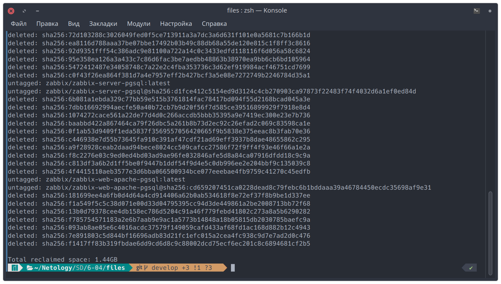
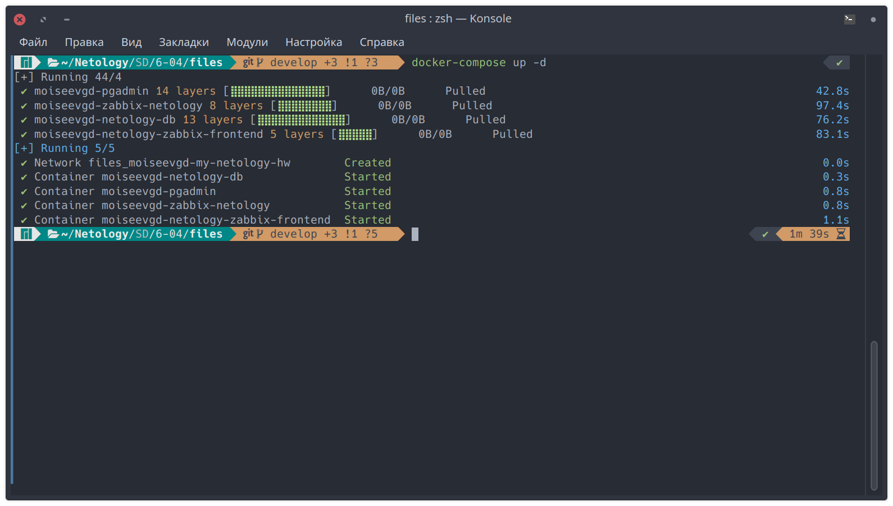

# Домашнее задание к занятию «Docker. Часть 2»

---

## Задание 1

Установите Docker Compose и опишите, для чего он нужен и как может улучшить вашу жизнь.

- Docker Compose - это инструмент для определения и запуска многоконтейнерных приложений Docker с помощью удобного файла конфигурации YAML. Он позволяет легко настроить, запускать и масштабировать приложения, обеспечивая их надежность и изоляцию. Docker Compose упрощает разработку, тестирование и развертывание приложений, уменьшая сложность инфраструктуры и сокращая время настройки окружения, что в свою очередь делает жизнь проще и продуктивнее.



---

## Задание 2

Создайте файл docker-compose.yml и внесите туда первичные настройки:

- version;
- services;
- networks.

При выполнении задания используйте подсеть 172.22.0.0.
Ваша подсеть должна называться: <ваши фамилия и инициалы>-my-netology-hw.

```yaml
version: '3'

services:

networks:
  moiseevgd-my-netology-hw:
    driver: bridge
    ipam:
      config:
        - subnet: 172.22.0.0/24
```

---

## Задание 3

1. Установите PostgreSQL с именем контейнера <ваши фамилия и инициалы>-netology-db.
2. Предсоздайте БД <ваши фамилия и инициалы>-db.
3. Задайте пароль пользователя postgres, как <ваши фамилия и инициалы>12!3!!
4. Пример названия контейнера: ivanovii-netology-db.
5. Назначьте для данного контейнера статический IP из подсети 172.22.0.0/24.

```yaml
moiseevgd-netology-db:
  image: postgres
  container_name: moiseevgd-netology-db
  ports:
    - 5432:5432
  volumes:
    - ./pg_data:/var/lib/postgresql/data/pgdata
  environment:
    POSTGRES_DB: moiseevgd-db
    POSTGRES_PASSWORD: moiseevgd12!3!!
    PGDATA: /var/lib/postgresql/data/pgdata
  networks:
    moiseevgd-my-netology-hw:
    ipv4_address: 172.22.0.2
  restart: always
```

---

## Задание 4

1. Установите pgAdmin с именем контейнера <ваши фамилия и инициалы>-pgadmin.
2. Задайте логин администратора pgAdmin <ваши фамилия и инициалы>@ilove-netology.com и пароль на выбор.
3. Назначьте для данного контейнера статический IP из подсети 172.22.0.0/24.
4. Прокиньте на 80 порт контейнера порт 61231.

В качестве решения приложите:

- текст конфига текущего сервиса;
- скриншот админки pgAdmin.

```yaml
moiseevgd-pgadmin:
  image: dpage/pgadmin4
  links:
    - moiseevgd-netology-db
  container_name: moiseevgd-pgadmin
  environment:
    PGADMIN_DEFAULT_EMAIL: moiseevgd@ilove-netology.com
    PGADMIN_DEFAULT_PASSWORD: 1234
  ports:
    - 61231:80
  networks:
    moiseevgd-my-netology-hw:
    ipv4_address: 172.22.0.3
  restart: always
```



---

## Задание 5

1. Установите Zabbix Server с именем контейнера <ваши фамилия и инициалы>-zabbix-netology.
2. Настройте его подключение к вашему СУБД.
3. Назначьте для данного контейнера статический IP из подсети 172.22.0.0/24.

```yaml
moiseevgd-zabbix-netology:
  image: zabbix/zabbix-server-pgsql
  links:
    - moiseevgd-netology-db
  container_name: moiseevgd-zabbix-netology
  environment:
    DB_SERVER_HOST: 172.22.0.2
    POSTGRES_USER: postgres
    POSTGRES_PASSWORD: moiseevgd12!3!!
  ports:
    - 10051:10051
  networks:
    moiseevgd-my-netology-hw:
      ipv4_address: 172.22.0.4
  restart: always
```

---

## Задание 6

1. Установите Zabbix Frontend с именем контейнера <ваши фамилия и инициалы>-netology-zabbix-frontend.
2. Настройте его подключение к вашему СУБД.
3. Назначьте для данного контейнера статический IP из подсети 172.22.0.0/24.

```yaml
moiseevgd-netology-zabbix-frontend:
  image: zabbix/zabbix-web-apache-pgsql
  links:
    - moiseevgd-netology-db
    - moiseevgd-zabbix-netology
  container_name: moiseevgd-netology-zabbix-frontend
  environment:
    DB_SERVER_HOST: 172.22.0.2
    POSTGRES_USER: postgres
    POSTGRES_PASSWORD: moiseevgd12!3!!
    ZBX_SERVER_HOST: 172.22.0.4
    PHP_TZ: "Europe/Moscow"
  ports:
    - 80:8080
    - 443:8443
  networks:
    moiseevgd-my-netology-hw:
      ipv4_address: 172.22.0.5
  restart: always
```

---

## Задание 7

Настройте линки, чтобы контейнеры запускались только в момент, когда запущены контейнеры, от которых они зависят.

В качестве решения приложите:

- текст конфига **целиком**;

```yaml
version: '3'

services:
  moiseevgd-netology-db:
    image: postgres
    container_name: moiseevgd-netology-db
    ports:
      - 5432:5432
    volumes:
      - ./pg_data:/var/lib/postgresql/data/pgdata
    environment:
      POSTGRES_DB: moiseevgd-db
      POSTGRES_PASSWORD: moiseevgd12!3!!
      PGDATA: /var/lib/postgresql/data/pgdata
    networks:
      moiseevgd-my-netology-hw:
        ipv4_address: 172.22.0.2
    restart: always

  moiseevgd-pgadmin:
    image: dpage/pgadmin4
    links:
      - moiseevgd-netology-db
    container_name: moiseevgd-pgadmin
    environment:
      PGADMIN_DEFAULT_EMAIL: moiseevgd@ilove-netology.com
      PGADMIN_DEFAULT_PASSWORD: 1234
    ports:
      - 61231:80
    networks:
      moiseevgd-my-netology-hw:
        ipv4_address: 172.22.0.3
    restart: always

  moiseevgd-zabbix-netology:
    image: zabbix/zabbix-server-pgsql
    links:
      - moiseevgd-netology-db
    container_name: moiseevgd-zabbix-netology
    environment:
      DB_SERVER_HOST: 172.22.0.2
      POSTGRES_USER: postgres
      POSTGRES_PASSWORD: moiseevgd12!3!!
    ports:
      - 10051:10051
    networks:
      moiseevgd-my-netology-hw:
        ipv4_address: 172.22.0.4
    restart: always
    
  moiseevgd-netology-zabbix-frontend:
    image: zabbix/zabbix-web-apache-pgsql
    links:
      - moiseevgd-netology-db
      - moiseevgd-zabbix-netology
    container_name: moiseevgd-netology-zabbix-frontend
    environment:
      DB_SERVER_HOST: 172.22.0.2
      POSTGRES_USER: postgres
      POSTGRES_PASSWORD: moiseevgd12!3!!
      ZBX_SERVER_HOST: 172.22.0.4
      PHP_TZ: "Europe/Moscow"
    ports:
      - 80:8080
      - 443:8443
    networks:
      moiseevgd-my-netology-hw:
        ipv4_address: 172.22.0.5
    restart: always

networks:
  moiseevgd-my-netology-hw:
    driver: bridge
    ipam:
      config:
        - subnet: 172.22.0.0/24
```

- скриншот команды docker ps;



- скриншот авторизации в админке Zabbix.



---

## Задание 8

**Выполните действия:**

1. Убейте все контейнеры и потом удалите их.
1. Приложите скриншот консоли с проделанными действиями.



---

## Дополнительные задания* (со звёздочкой)

---

## Задание 9*

Запустите свой сценарий на чистом железе без предзагруженных образов.

Подготовка "чистого железа":







1. Сколько ушло времени на то, чтобы развернуть на чистом железе написанный вами сценарий?

    - 99 секунд.

2. Чем вы занимались в процессе создания сценария так, как это видите вы?

    - В процессе создания сценария я описывал сервисы, их настройки и взаимодействие их друг с другом.

3. Что бы вы улучшили в сценарии развёртывания?

    - Вынес бы повторяющиеся настройки в переменные и спрятал бы логины и пароли в `secrets`, как в примере ниже.

    ```yaml
    secrets:
      db_password:
        file: db_password.txt
      db_root_password:
        file: db_root_password.txt
    ```
