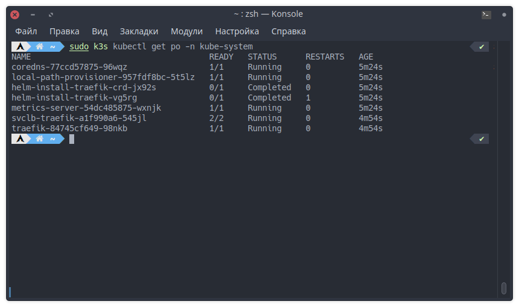
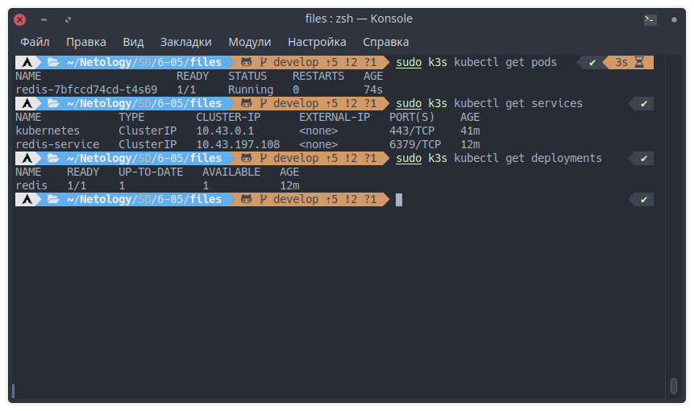
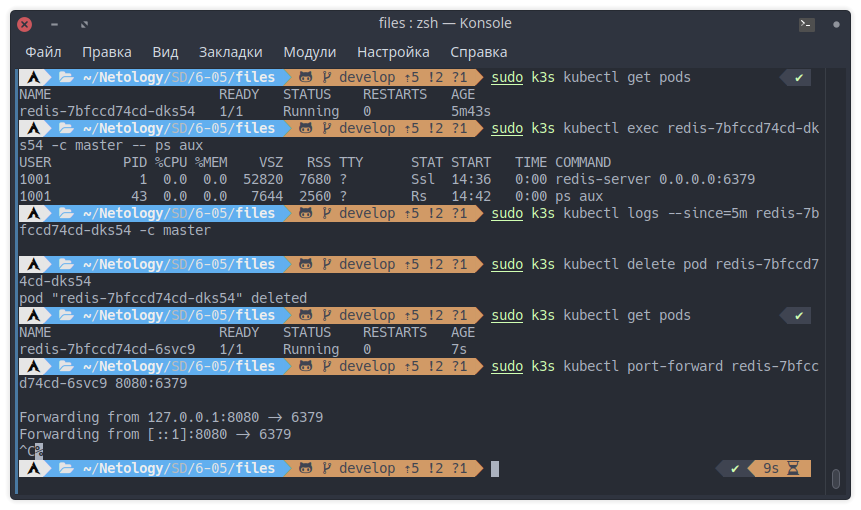

# Домашнее задание к занятию «Kubernetes. Часть 1»

---

## Задание 1

**Выполните действия:**

1. Запустите Kubernetes локально, используя k3s или minikube на свой выбор.
2. Добейтесь стабильной работы всех системных контейнеров.
3. В качестве ответа пришлите скриншот результата выполнения команды kubectl get po -n kube-system.

   

---

## Задание 2

Есть файл с деплоем:

```yaml
---
apiVersion: apps/v1
kind: Deployment
metadata:
  name: redis
spec:
  selector:
    matchLabels:
      app: redis
  replicas: 1
  template:
    metadata:
      labels:
        app: redis
    spec:
      containers:
      - name: master
        image: bitnami/redis
        env:
         - name: REDIS_PASSWORD
           value: password123
        ports:
        - containerPort: 6379
```

---

**Выполните действия:**

1. Измените файл с учётом условий:

   * redis должен запускаться без пароля;
   * создайте Service, который будет направлять трафик на этот Deployment;
   * версия образа redis должна быть зафиксирована на 6.0.13.

2. Запустите Deployment в своём кластере и добейтесь его стабильной работы.
3. В качестве решения пришлите получившийся файл.

   Получившийся [файл](files/redis.yaml)

   

---

## Задание 3

**Выполните действия:**

1. Напишите команды kubectl для контейнера из предыдущего задания:

   * выполнения команды ps aux внутри контейнера;
   * просмотра логов контейнера за последние 5 минут;
   * удаления контейнера;
   * проброса порта локальной машины в контейнер для отладки.

2. В качестве решения пришлите получившиеся команды.

   * `kubectl exec <pod_name> -c <container_name> -- ps aux`
   * `kubectl logs --since=5m <pod_name> -c <container_name>`
   * `kubectl delete pod <pod_name>`
   * `kubectl port-forward <pod_name> <local_port>:<container_port>`

    

---
