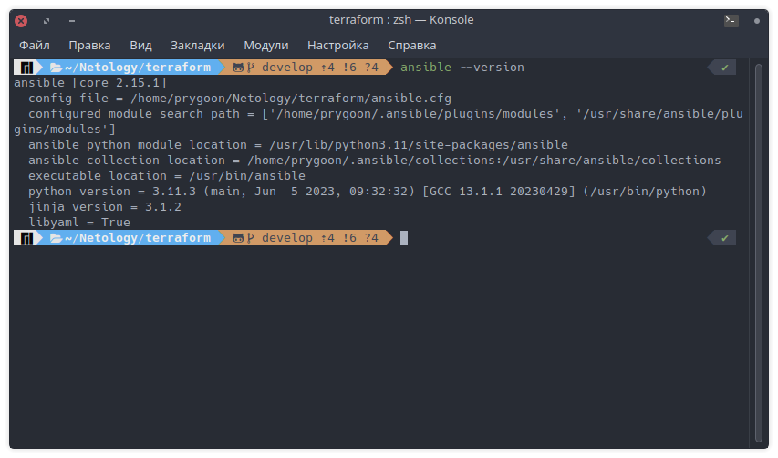

# Домашнее задание к занятию «Ansible. Часть 1»

---

## Задание 1

**Ответьте на вопрос в свободной форме.**

Какие преимущества даёт подход IAC?

Подход IAC (Infrastructure as Code) имеет следующие преимущества:

* Автоматизация и повторяемость развёртывания и управления инфраструктурой.
* Масштабируемость системы и приложений.
* Управление версиями и контроль изменений с использованием системы контроля версий.
* Документация и стандартизация развёртывания.
* Облегчение восстановления и воспроизведения системы.

---

## Задание 2

**Выполните действия и приложите скриншоты действий.**

1. Установите Ansible.

    

2. Настройте управляемые виртуальные машины, не меньше двух.

    

3. Создайте файл inventory. Предлагается использовать файл, размещённый в папке с проектом, а не файл inventory по умолчанию.

    * Написал [скрипт](../../terraform/start.sh), который запускает терраформ, выдёргивает из вывода внешние IP адреса и кладет их в инвентори.

    

4. Проверьте доступность хостов с помощью модуля ping.

    

---

## Задание 3

**Ответьте на вопрос в свободной форме.**

Какая разница между параметрами forks и serial?

* Параметр forks в Ansible определяет количество одновременно выполняемых процессов для задач на целевых узлах.
* Параметр serial устанавливает количество целевых узлов, на которых Ansible выполняет задачи одновременно, разделяя их на партии.

---

## Задание 4

В этом задании вы будете работать с Ad-hoc коммандами.

**Выполните действия и приложите скриншоты запуска команд.**

1. Установите на управляемых хостах любой пакет, которого нет.

    

2. Проверьте статус любого, присутствующего на управляемой машине, сервиса.

    

3. Создайте файл с содержимым «I like Linux» по пути /tmp/netology.txt.

    
