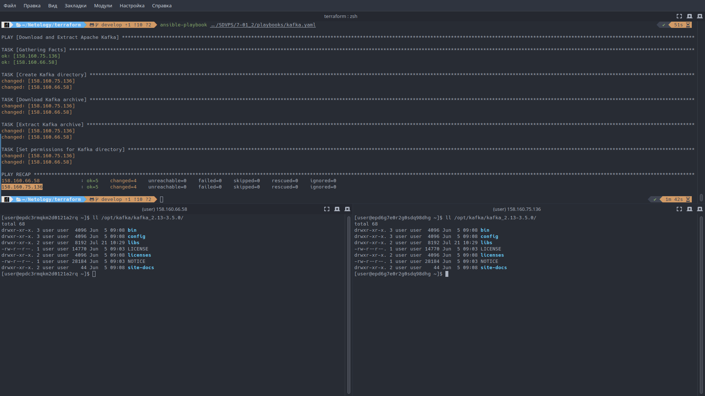
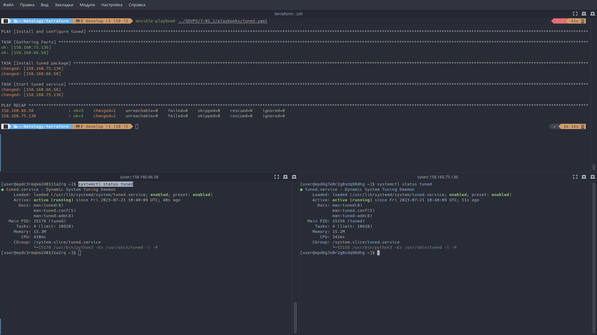
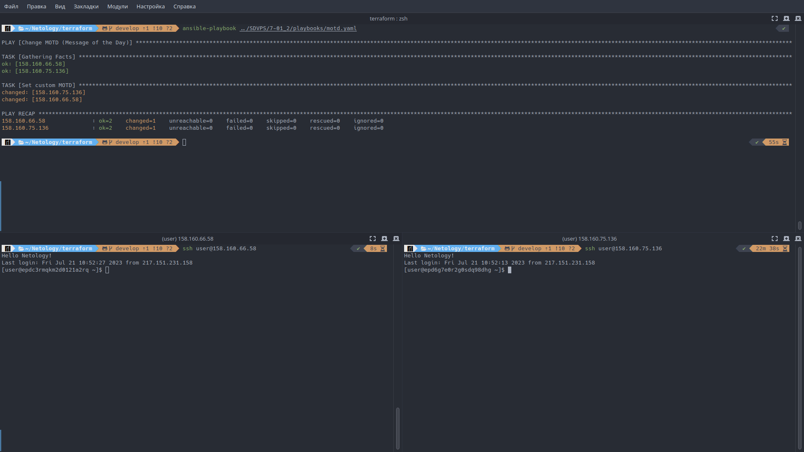
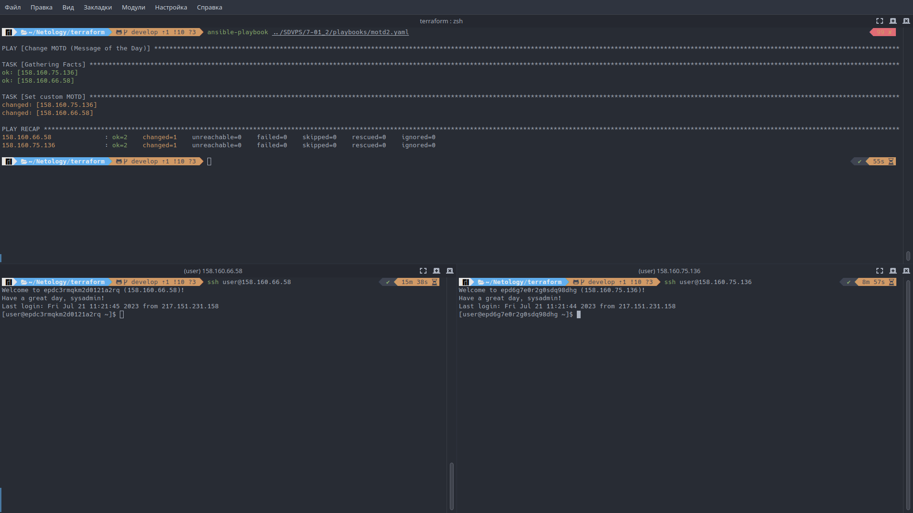
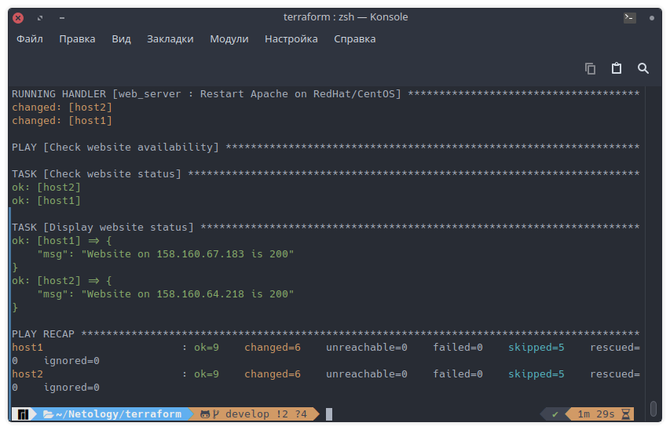
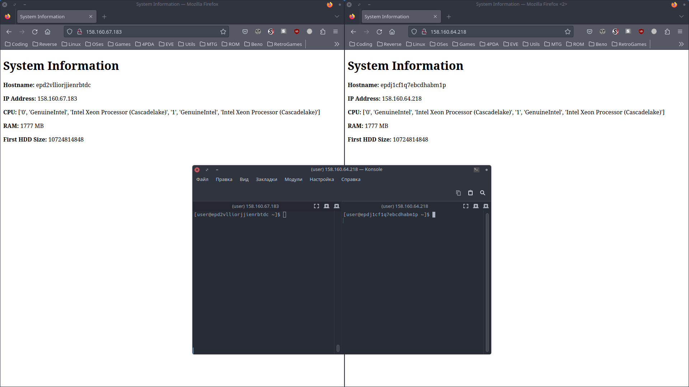

# Домашнее задание к занятию «Ansible.Часть 2»

## Задание 1

**Выполните действия, приложите файлы с плейбуками и вывод выполнения.**

Напишите три плейбука. При написании рекомендуем использовать текстовый редактор с подсветкой синтаксиса YAML.

Плейбуки должны:

1. Скачать какой-либо архив, создать папку для распаковки и распаковать скаченный архив. Например, можете использовать [официальный сайт](https://kafka.apache.org/downloads) и зеркало Apache Kafka. При этом можно скачать как исходный код, так и бинарные файлы, запакованные в архив — в нашем задании не принципиально.

    [Плейбук 1](playbooks/task_1/kafka.yaml).

    Результат:

    

2. Установить пакет tuned из стандартного репозитория вашей ОС. Запустить его, как демон — конфигурационный файл systemd появится автоматически при установке. Добавить tuned в автозагрузку.

    [Плейбук 2](playbooks/task_1/tuned.yaml).

    Результат:

    

3. Изменить приветствие системы (motd) при входе на любое другое. Пожалуйста, в этом задании используйте переменную для задания приветствия. Переменную можно задавать любым удобным способом.

    [Плейбук 3](playbooks/task_1/motd.yaml) и [шаблон](playbooks/task_1/templates/motd.j2) для него.

    Результат:

    

## Задание 2

**Выполните действия, приложите файлы с модифицированным плейбуком и вывод выполнения.**

Модифицируйте плейбук из пункта 3, задания 1. В качестве приветствия он должен установить IP-адрес и hostname управляемого хоста, пожелание хорошего дня системному администратору.

[Плейбук 4](playbooks/task_2/motd2.yaml) и [шаблон](playbooks/task_2/templates/motd2.j2) для него.

Результат:

## Задание 3

**Выполните действия, приложите архив с ролью и вывод выполнения.**

Создайте плейбук, который будет включать в себя одну, созданную вами роль. Роль должна:

1. Установить веб-сервер Apache на управляемые хосты.
2. Сконфигурировать файл index.html c выводом характеристик каждого компьютера как веб-страницу по умолчанию для Apache. Необходимо включить CPU, RAM, величину первого HDD, IP-адрес. Используйте [Ansible facts](https://docs.ansible.com/ansible/latest/playbook_guide/playbooks_vars_facts.html) и [jinja2-template](https://linuxways.net/centos/how-to-use-the-jinja2-template-in-ansible/)
3. Открыть порт 80, если необходимо, запустить сервер и добавить его в автозагрузку.
4. Сделать проверку доступности веб-сайта (ответ 200, модуль uri).

В качестве решения:

- предоставьте плейбук, использующий роль;

    [Плейбук 5](playbooks/task_3/web_server_playbook.yaml)

- разместите архив созданной роли у себя на Google диске и приложите ссылку на роль в своём решении;

    [Архив роли](playbooks/task_3/web_server.zip)

- предоставьте скриншоты выполнения плейбука;

    

- предоставьте скриншот браузера, отображающего сконфигурированный index.html в качестве сайта.

    
