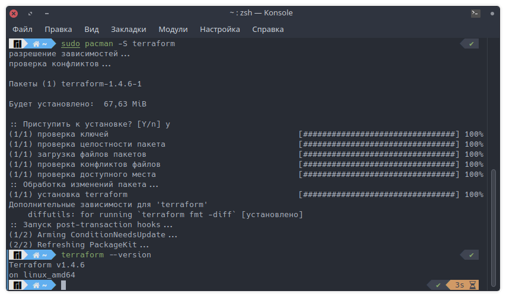

# Домашнее задание к занятию «Terraform»

## Задание 1

**Ответьте на вопрос в свободной форме.**

Опишите виды подхода к IaC:

* функциональный подход нацелен на то, чтобы описать, как должна выглядеть целевая конфигурация;
* процедурный сфокусирован на том, какие внести изменения;
* интеллектуальный описывает, почему инфраструктура должна быть так сконфигурирована.

---

## Задание 2

**Ответьте на вопрос в свободной форме.**

Как вы считаете, в чём преимущество применения Terraform?

1. Декларативный подход: Простое и повторяемое управление инфраструктурой с помощью файлов конфигурации.

2. Поддержка множества провайдеров: Возможность работать с различными облачными платформами.

3. Планирование и предпросмотр изменений: Возможность видеть изменения перед их применением.

4. Управление состоянием: Отслеживание текущего состояния инфраструктуры для контроля и восстановления.

5. Модульность и переиспользование: Создание и повторное использование модулей для стандартизации и упрощения конфигурации.

---

## Задание 3

**Ответьте на вопрос в свободной форме.**

Какие минусы можно выделить при использовании IaC?

* Разработка IaC может потребовать использования
дополнительных утилит, а любые ошибки при таком
проектировании могут быть быстро распространены по всем
окружениям проекта, поэтому IaC должен быть всесторонне
протестирован.

* Вероятность внесение изменений в окружение администратором
без внесения соответствующих изменений в IaC, поэтому
особенно важно полностью интегрировать IAC в процесс
системного администрирования, во все IT и DevOps-процессы
и вести документацию

---

## Задание 4

**Выполните действия и приложите скриншоты запуска команд.**

Установите Terraform на компьютерную систему.

---

## Дополнительные задания* (со звёздочкой)

Их выполнение необязательное и не влияет на получение зачёта по домашнему заданию. Можете их решить, если хотите лучше разобраться в материале.лнить, если хотите глубже и/или шире разобраться в материале.

---

## Задание 5*

**Ответьте на вопрос в свободной форме.**

Перечислите основные функции, которые могут использоваться в Terraform.

* Вот некоторые из встроенных функций, доступных в Terraform. Они предоставляют возможности для манипуляции данными, выполнения операций со списками и картами, чтения файлов и форматирования строк, что делает конфигурацию более гибкой и динамичной.

    **element**: Функция element используется для доступа к элементу списка или карты по индексу. Она принимает список или карту и индекс, и возвращает соответствующий элемент.

    **concat**: Функция concat объединяет несколько списков или строк в один. Она принимает один или несколько аргументов и возвращает объединенный список или строку.

    **join**: Функция join объединяет элементы списка в одну строку с использованием разделителя. Она принимает разделитель и список, и возвращает строку, в которой элементы списка объединены разделителем.

    **length**: Функция length возвращает длину списка или строки. Она принимает список или строку и возвращает количество элементов или символов в них.

    **lookup**: Функция lookup используется для получения значения из карты по ключу. Она принимает карту и ключ, и возвращает соответствующее значение.

    **map**: Функция map создает карту из списка пар ключ-значение. Она принимает список пар ключ-значение и возвращает карту.

    **file**: Функция file читает содержимое файла и возвращает его как строку. Она принимает путь к файлу и возвращает содержимое файла.

    **jsondecode**: Функция jsondecode преобразует JSON-строку в структуру данных в Terraform. Она принимает JSON-строку и возвращает соответствующую структуру данных.

    **format**: Функция format создает отформатированную строку на основе шаблона и аргументов. Она принимает строку-шаблон и аргументы и возвращает отформатированную строку.
