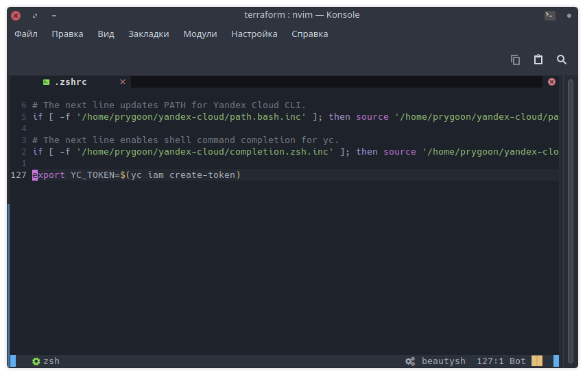
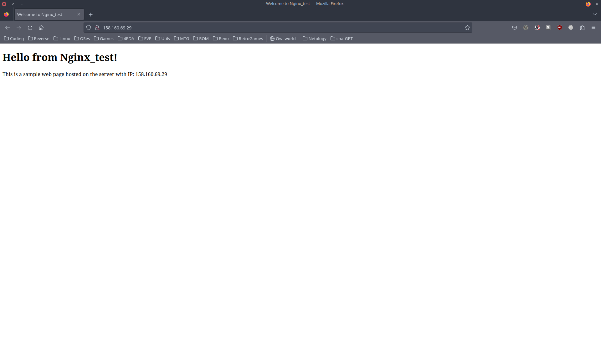
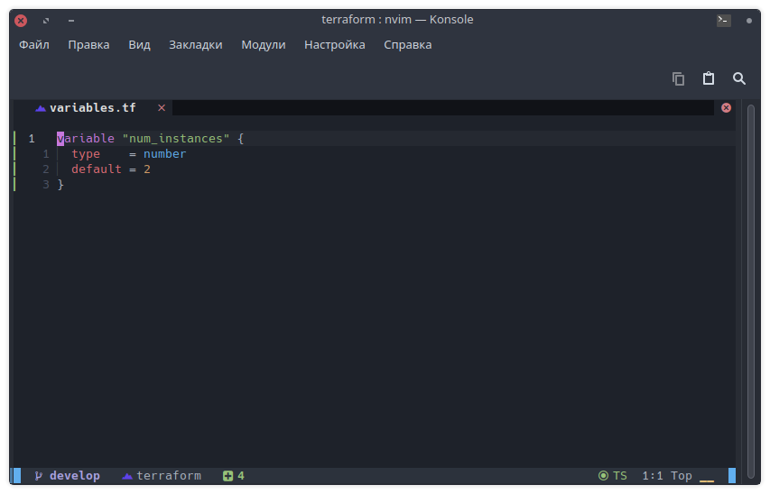
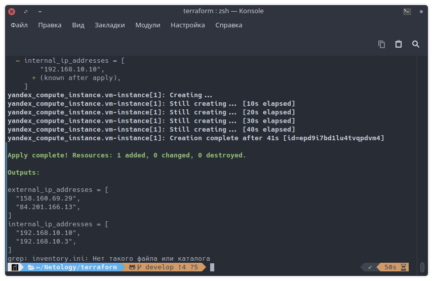
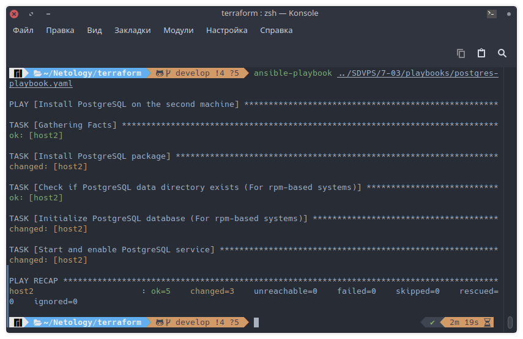
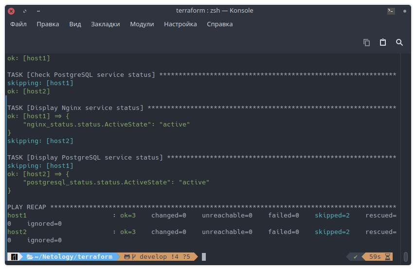

# Домашнее задание к занятию «Подъём инфраструктуры в Yandex Cloud»

 ---

## Задание 1

**Выполните действия, приложите скриншот скриптов, скриншот выполненного проекта.**

От заказчика получено задание: при помощи Terraform и Ansible собрать виртуальную инфраструктуру и развернуть на ней веб-ресурс.

В инфраструктуре нужна одна машина с ПО ОС Linux, двумя ядрами и двумя гигабайтами оперативной памяти.

Требуется установить nginx, залить при помощи Ansible конфигурационные файлы nginx и веб-ресурса.

- [Терраформ](../../terraform/main.tf)
- [Переменные](../../terraform/variables.tf) терраформа
- Ансибл [плейбук](playbooks/nginx-playbook.yaml)
- [Переменные](playbooks/vars.yaml) ансибла
- Шаблоны: [nginx.conf](playbooks/templates/nginx.conf.j2) и [веб](playbooks/templates/index.html.j2).

Секретный токен от yandex cloud должен вводится в консоли при каждом запуске terraform.

- Настроил так, чтобы ключ подтягивался из переменной окружения уже давно, сразу как установил терраформ.
  
  

Провести тестирование.

---

## Дополнительные задания* (со звёздочкой)

## Задание 2*

**Выполните действия, приложите скриншот скриптов, скриншот выполненного проекта.**

1. Перестроить инфраструктуру и добавить в неё вторую виртуальную машину.
    - В файле переменных терраформа меняем количество машин на 2.
  
    

    - После выполнения [скрипта](../../terraform/start.sh) в облако добавилась вторая машина и обновился файл инвентори.

    

2. Установить на вторую виртуальную машину базу данных.

    - [Плейбук](playbooks/postgres-playbook.yaml) для установки PostgreSQL.

    

3. Выполнить проверку состояния запущенных служб через Ansible.

    - [Плейбук] для проверки сервисов.

    

---

## Задание 3*

Добейтесь работы паплайна с безопасной передачей токена от облака в terraform через переменные окружения.

---
