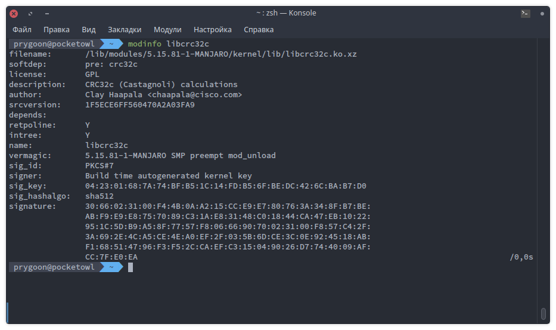
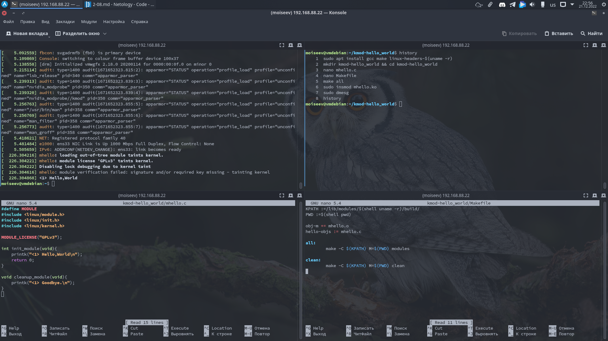

# Домашнее задание к занятию "Ядро операционной системы"

---

## Задание 1

1. При выполнении системного вызова от прикладной программы.
2. При аппаратном прерывании.

---

## Задание 2

---

## Задание 3

`chdir("/tmp")`

---

## Дополнительные задания (со звездочкой\*)

## Задание 4

**Соберите свой модуль и загрузите его в ядро.**

