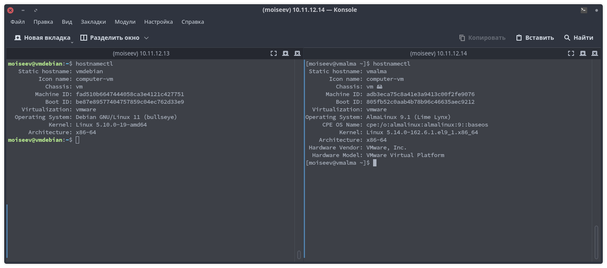

# Домашнее задание к занятию "Типы дистрибутивов Linux"

---

### Задание 1.

Дистрибутив – это форма распространения ПО. В состав дистрибутива обычно входят ядро ОС, пакетный менеджер, система инициализации, набор базового прикладного ПО, иногда какой-нибудь desktop enviroment.

---

### Задание 2.

Книга Эндрю Таннербаума «Операционные системы: разработка и реализация» (англ. Operating System: Design and Implementation) и ОС Minix (которую Таннербум написал для обучения студентов), вдохновили Линуса Торвальдса на создание ядра Linux. В автобиографии «Just For Fun» Торвальдс описывает её как «книга, которая подняла меня на новую высоту».

---

### Задание 3.

#### А теперь перейдем к практике

**3.1**

`yum/dnf install mc`

`apt install mc`

*Как получить информацию из какого репозитория был установлен пакет?*

`apt info mc | grep -i sources`

`dnf info mc | grep -i repository`

**3.2**

*Какой командой можно получить список доступных репозиториев в RPM и Deb- based системах? Два ответа для каждой из систем.*

Deb-based: `grep -rhE ^deb /etc/apt/sources.list*`

RPM-based: `yum repolist` или `dnf repolist`

**3.3**

*Как узнать версию ОС в Linux? Как узнать версию ядра? Укажите для вашей системы, неважно какой.*

`hostnamectl`

**3.4**

*Как узнать какая система инициализации используется в Linux? Укажите для вашей системы, неважно какой.*

`ls -lha /sbin/init`

---

**

## Дополнительные задания (со звездочкой*)
Эти задания дополнительные (не обязательные к выполнению) и никак не повлияют на получение вами зачета по этому домашнему заданию. Вы можете их выполнить, если хотите глубже и/или шире разобраться в материале.

**3.5**

Работайте на любом RPM или Deb- based Linux:

1) отключите автоматическую загрузку графической оболочки;
2) установите графическую оболочку, которой у вас нет в системе. Например, Mate, Xfce, Openbox;
3) включите автоматическую загрузку графической оболочки;
4) загрузитесь в новую графическую оболочку.

Так как это необязательное задание, то мучать виртуалки не буду (пусть останутся без GUI), но скриншоты разных DE, которые я устанавливал и использовал все-таки приложу.

*Приложите скриншоты вашего старого и нового рабочих столов.*

1. Начал знакомился GNU/Linux я с дистрибутива Debian на котором попеременно менялись 2 DE: xfce и mate (к сожалению скриншотов не осталось с тех пор).
Следующим этапом стала установка Ubuntu на домашний ПК с Unity DE:

2. В период дистрохоппинга перепробовал почти все популярные дистрибутивы и DE.

3. В итоге остановился на Arch и Arch-based (Manjaro) дистрибутивах с кедами на борту (Plasma в 5 своей версии уж очень удачная, на мой взгляд получилась).

