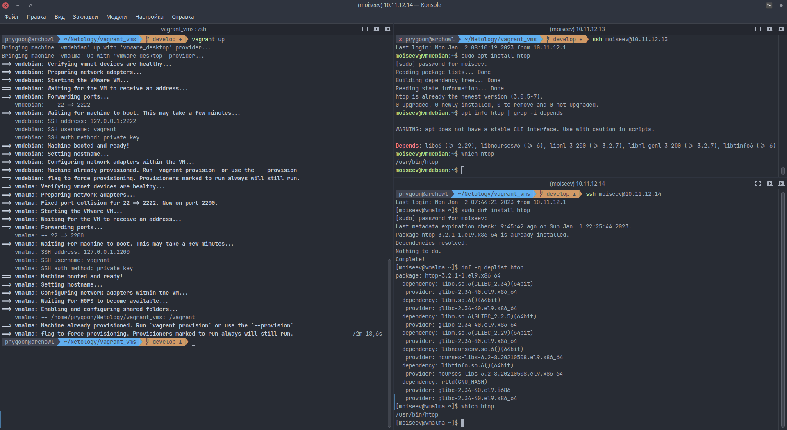

# Домашнее задание к занятию "Управление пакетами"

---

## Кейс 1

Опишите плюсы и минусы работы с пакетным менеджером и репозиторием.

Pros:

1. Удобство при установке ПО. Большинство программ устанавливается с помощью
   пакетного менеджера.
2. Автоматическое разрешение зависимостей пакетным менеджером.

Cons:

1. Репозитории необходимо кому-то (сообществу или организации) поддерживать.

---

## Кейс 2

В Deb-based дистрибутивах нужно добавить в систему gpg-ключ и добавить адрес
репозитория в `/etc/apt/source.list` (но лучше создать `свой.list` файл в
каталоге `/etc/apt/source.list.d`).

В RPM-based дистрибутивах надо добавить новый файл с суффиксом .repo в
каталог `/etc/yum.repos.d/` и выполнить команду

```bash
dnf config-manager --add-repo repository
```

или

```bash
yum-config-manager --add-repo repository
```

где `repository` - путь к созданному `.repo` файлу.

- В чем опасность такого способа распространения ПО?

Опасность в том, что с непроверенных сторонних репозиториев выше вероятность
установить себе вредоносное ПО.

- Как это решается?

Можно почитать мнение сообщества о данном репозитории, либо найти исходники и
собрать из них самому.

---

## Кейс 3

### Перейдем к практике

1. Запустите свою виртуальную машину.
2. Найдите в репозиториях и установите одной командой пакет `htop`.

Для Deb-based:

```bash
sudo apt install htop
```

Для RPM-based:

```bash
sudo yum install htop или sudo dnf install htop
```

3. Какие зависимости требует `htop`?
4. Приложите скриншот места расположения исполняемых файлов установленного ПО.



---

## Кейс 4

1. Подключите репозиторий PHP и установите PHP 8.0.

В установленной у меня виртуальной машине с Alma Linux PHP 8.0 присутствует в
официальном репозитории, чтобы задание не потеряло смысл установлю версию 8.2
из стороннего репозитория.

_Приложите скриншот содержимого файла, в котором записан адрес репозитория._


2. При помощи команды `php -v` убедитесь, что бы поставлена корректная версия PHP.


---

## Кейс 5

Ваш коллега-программист просит вас установить модуль `google-api-python-client`
на сервер, который необходим для программы, работающей с Google API.

Установите данный пакет при помощи менеджера пакетов `pip`.

Для программы работающей с модулем `google-api-python-client` я бы создал
отдельное окружение (самый простой способ с помощью команды:

```bash
python3 -m venv venv && source venv/bin/activate
```

чтобы не засорять пакетами из PyPi систему. После чего установил бы в это
окружение сам модуль командой:

```bash
pip install google-api-python-client
```


---

\*\*

## Дополнительные задания (со звездочкой\*)

## Кейс 6\*

1. Перечислите менеджеры пакетов, кроме тех, о которых говорилось на лекции.
   В каких дистрибутивах они работают?

- pacman - Arch Linux
- portage - Gentoo
- swupd - Clear Linux OS
- xbps - Void Linux
- nix - NixOS (может применяться и в других дистрибутивах)

2. Есть ли альтернативные менеджеры для тех, которые разбирались на лекции?

Альтернативы для `apt`: `dpkg`, `aptitude` (не имеет коровьей суперсилы, в
отличие от `apt`).

Альтернативы для `yum`: `rpm`, `dnf`.
