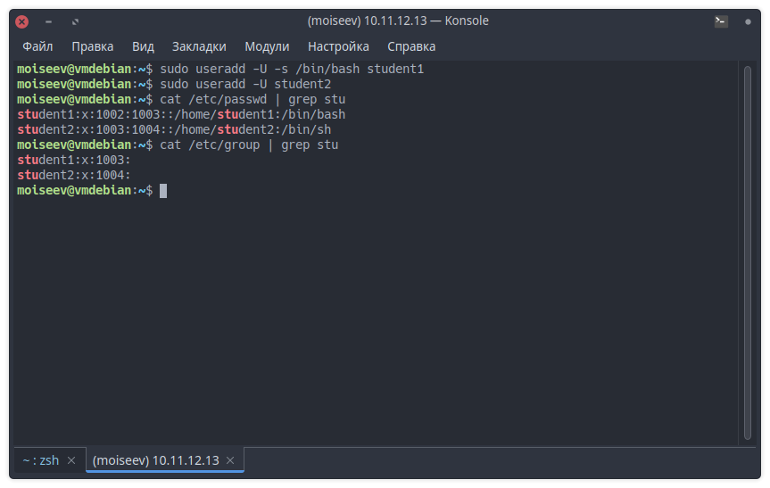
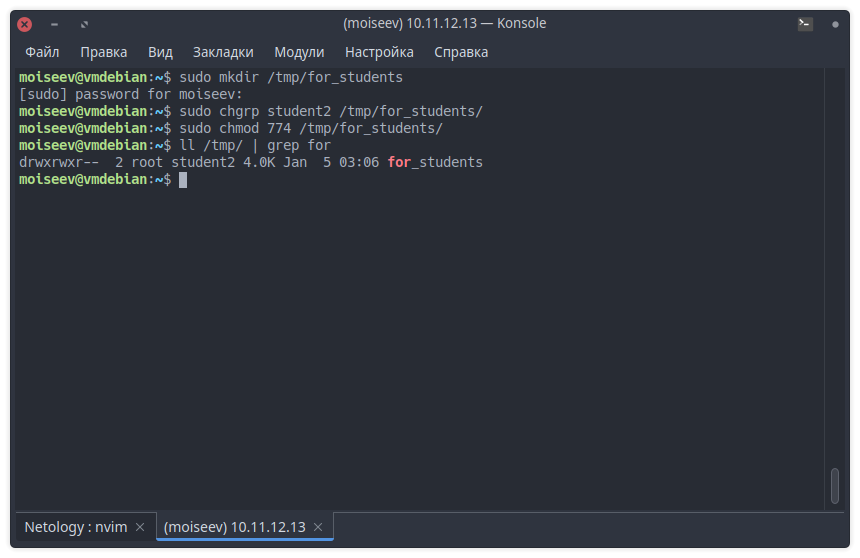
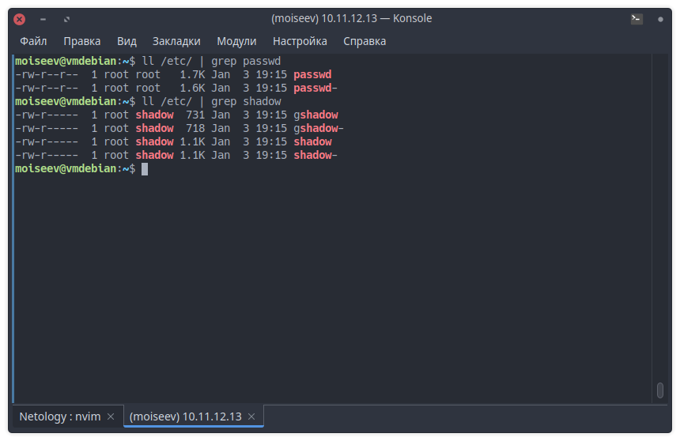
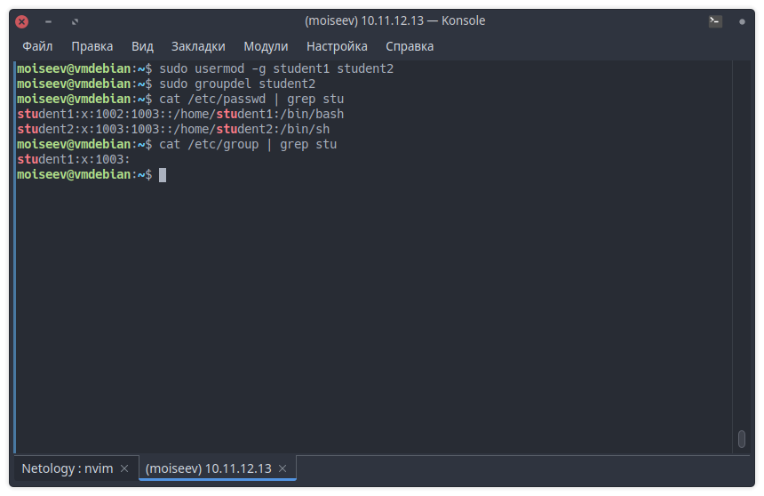
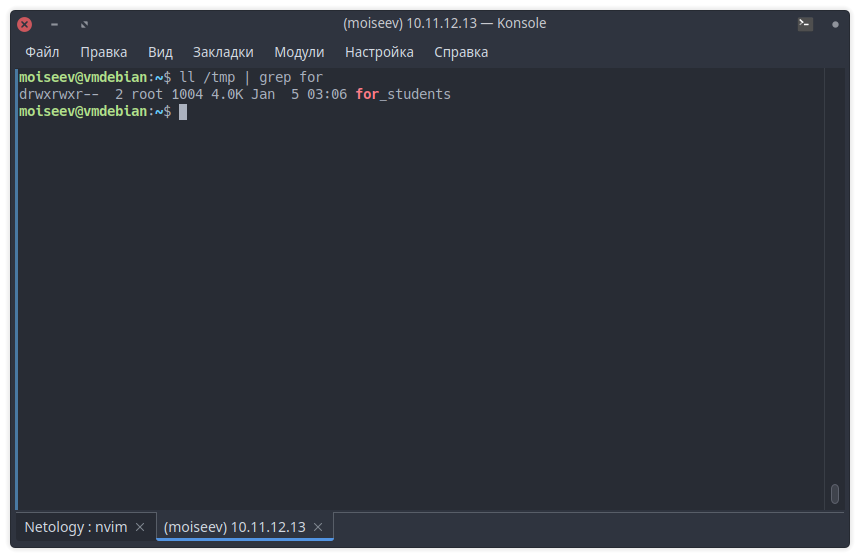
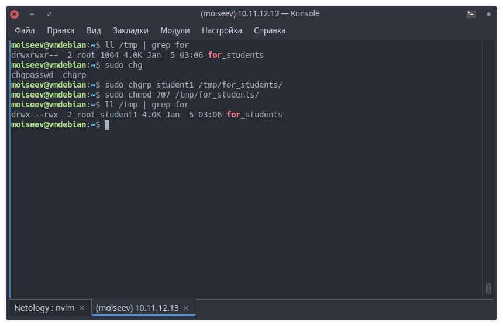
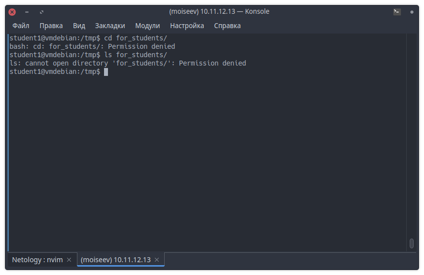

# Домашнее задание к занятию "Управление пользователями"

## Задание 1

Создайте пользователя `student1` с оболочкой bash, входящего в группу `student1`.

Создайте пользователя `student2`, входящего в группу `student2`.

## Задание 2

Создайте в общем каталоге (например, /tmp) директорию и назначьте для неё полный
доступ со стороны группы `student2` и доступ на чтение всем остальным

---

## Задание 3

Какой режим доступа установлен для файлов `/etc/passwd` и `/etc/shadow`?

У файла `/etc/passwd` установлены права доступа на запись и чтение для пользователя
`root` и на чтение для группы `root` и всех остальных.  
У файла `/etc/shadow` установлены права доступа на запись и чтение для пользователя
`root`, на чтение для группы `shadow` и закрыт доступ для всех остальных.

Объясните, зачем понадобилось именно два файла?

Изначально хеши паролей хранились во втором поле в файле `/etc/passwd`, позже в
целях безопасности хеши паролей были перенесены в отдельный файл `/etc/shadow`,
недоступный для чтения обычным пользователям.

---

## Задание 4

Удалите группу `student2`, а пользователя `student2` добавьте в группу `student1`.

---

## Дополнительные задания (со звездочкой\*)

## Задание 5\*

Создайте в общем каталоге (например, /tmp) директорию и назначьте для неё полный
доступ для всех, кроме группы `student1`. Группа `student1` не должна иметь доступа
к содержимому этого каталога.

