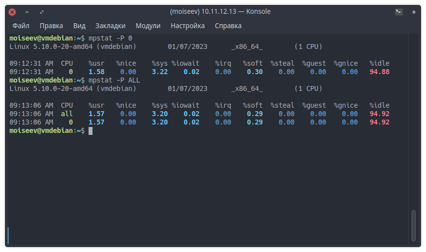

# Домашнее задание к занятию "Производительность системы"

------

### Задание 1.

Выполните проверку системы при помощи команды `top`.

**Выведите сортировку процессов по:**

- памяти;

- времени работы;

- номеру;

- уровню потребления ресурсов (CPU?).

------

### Задание 2.

Выполните проверку системы при помощи команды `atop` и `atopsar`.

**Выведите сортировку процессов по:**

- общей нагрузке (минимум по трем параметрам);

CPU:

Memory:

Disk usage:

- загруженности HDD or SSD за указанный временной отрезок (10 минут);

- загруженности RAM за указанный временной отрезок (10 минут).

**Сконфигурировать файл настроек atop - делать снимок памяти каждые пол часа**

------

### Задание 3.

При помощи команды `mpstat` и ключа `P` выведите информацию по:

- определённому процессору;
- всем процессорам.

------

### Задание 4.

Выполните проверку системы при помощи команды `pidstat`.

1. Выведите статистику по эффективности на основе имени процесса.
2. Выведите полный путь процесса.

---
