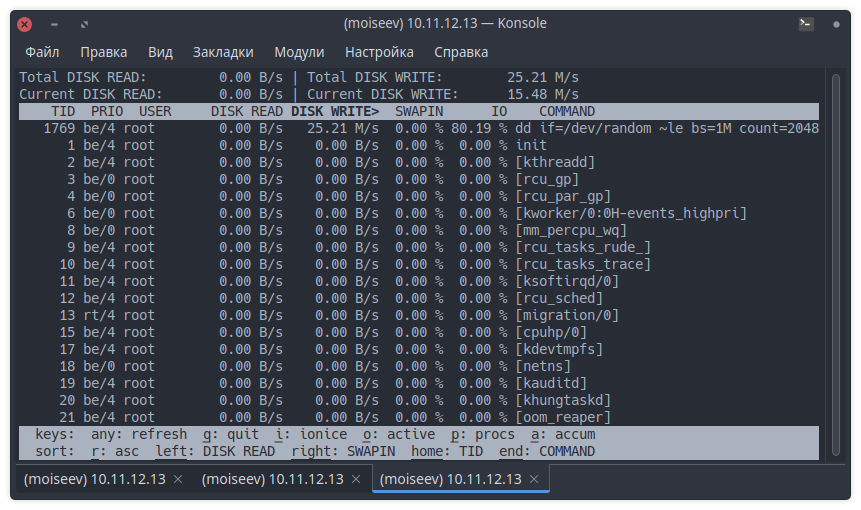

# Домашнее задание к занятию "Производительность системы. Часть 2."

------

### Задание 1.

Составьте задание через утилиту `cron` на проверку обьема кэша-обновлений еженедельно.

Кэш-обновлений - это обновления которые остаются после выполнения `apt update`, `apt upgrade`.

```bash
crontab -e
```


```bash
du -hs /var/cache/apt/archives/ >> /home/moiseev/apt.cache
```

------

### Задание 2.

- Запустите процесс копирования большого файла (2 Гб) на жесткий диск.


- Запустите команду `iostat`.


- Запустите `iotop`.



Какие процессы влияют на данные команды?

На вывод данных команд влияют все процессы, которые осуществляют чтение с дисков и запись на них.


------

### Задание 3.

Настройте приоритет использования `swap` в пропорции:

- 30/70;
- 50/50;
- 70/30.

Запустите браузер и нагрузите память.

Так как на моих виртуальных машинах не установлено никакого DE, а как нагрузить систему браузерами `lynx` или `links` не придумал, то нагрузку на RAM буду эмулировать следующей командой:
```bash
cat /dev/zero | head -c 1G | tail
```
Это работает потому, что `tail` должен держать в памяти текущую строку, на случай, если она окажется последней. Строка, считанная с `/dev/zero`, который выводит только нулевые байты и никаких новых строк, будет бесконечно длинной, но ограничена `head` байтами `BYTES`, поэтому tail будет использовать только этот объем памяти.


Результат:


Чем выше параметр `vm.swappiness`, тем активнее используется swap файл или раздел. Так как swap раздел или файл находятся на диске и операции чтения и записи на диск гораздо медленее, чем в RAM, то процессы, выполняются медленее.

------
