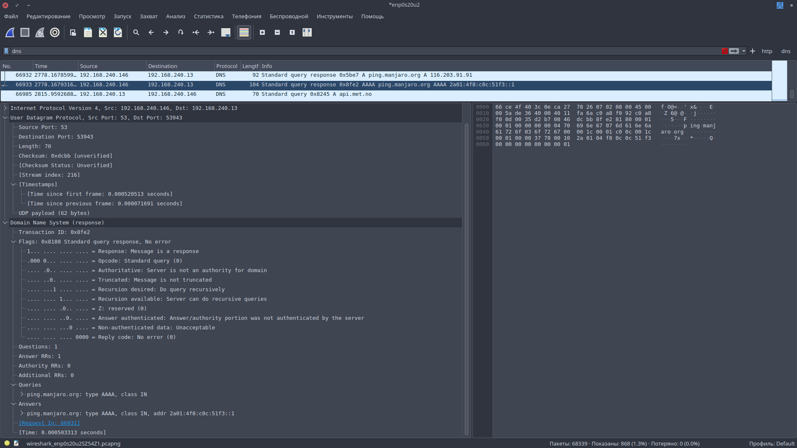

# Домашнее задание к занятию "Теоретические основы сети. Модель OSI и TCP/IP"

---

## Задание 1. Анализ захвата трафика

Описание задания
Вам поставили задачу проанализировать результаты захвата трафика сетевого интерфейса.
Это базовый навык при работе с сетью. В будущем он пригодится вам для того, чтобы
выявлять источники проблем в сети и проверять проблемы безопасности (траблшутинг).

1. Откройте Wireshark.
2. Запустите захват трафика с сетевого интерфейса.
3. Запустите браузер и зайдите на любой сайт.
4. Выберите какой-нибудь пакет из захваченного трафика.
5. Посмотрите разные уровни и разверните параметры при необходимости.
6. Напишите, какие протоколы и уровни модели OSI вы видите. Ответ внесите в
комментарии к решению задания в личном кабинете Нетологии.

Канальный уровень. На скриншоте видно кадр (Frame) и физические (MAC) адреса
источника (source) и адресата (destination).

Сетевой уровень. На скриншоте видны IP адреса источника и назначения. Так же можно
узнать, что этот пакет не фрагментирован.

Транспортный и сессионный уровень. На скриншоте видно установление TCP соединения
(SYN/ACK) и порты источника и назначения.

Уровень приложений. Видно, что в этом пакете передается ответ с кодом 200 на
HTTP запрос.

---

## Задание 2. Инкапсуляция данных

Описание задания
Вам поставили задачу найти различия в инкапсуляции данных разных протоколов и
технологий. Это также базовый навык при работе с сетью. Вы сможете понимать, как
одни приложения и технологии зависят от других протоколов и приложений. Это
позволит эффективнее решать сетевые проблемы.

1. Откройте Wireshark.
2. Запустите захват трафика с сетевого интерфейса.
3. Запустите браузер и зайдите на любой сайт.
4. Сначала установите фильтр захваченного трафика по технологии DNS, затем
выберите любой HTTP-поток.
5. Сравните пакеты между собой. В чём отличия с точки зрения модели OSI?
Ответ внесите в комментарии к решению задания в личном кабинете Нетологии.

Пакет DNS трафика:

Пакет HTTP трафика:

С точки зрения модели OSI отличие в том, что при передаче пакета HTTP трафика
присутствует сессионый уровень, который реализуется в протоколe TCP с помощью
SYN/SYN-ACK/ACK хендшейка. В UDP протоколе такой механизм отсустсвует.

---
