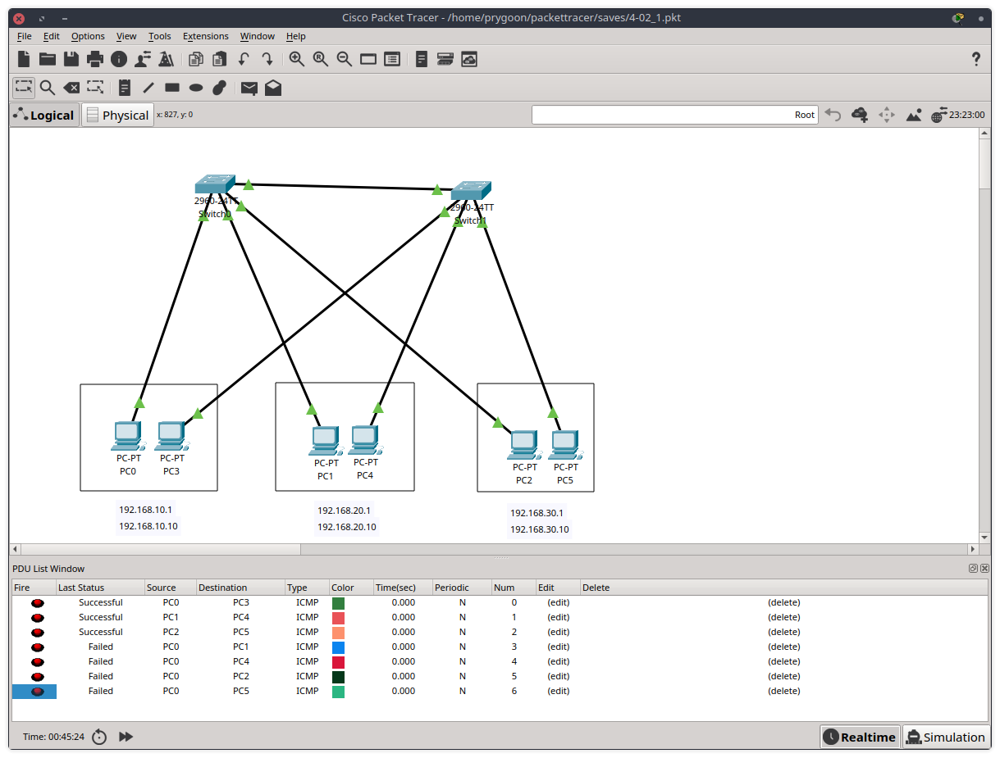

# Домашнее задание к занятию "L2-сеть"

## Задание 1. Сборка локальной сети

Описание задания
Вам нужно собрать небольшую локальную сеть, состоящую из шести компьютеров. На устройствах работают сотрудники из трёх разных отделов, необходимо изолировать их друг от друга.

### Требования к результату

- Отправьте PKT-файл с выполненным заданием.
- Добавьте скриншоты с доступностью устройств между собой и ответ на вопрос.

### Процесс выполнения

1. Запустите программу Cisco Packet Tracer.
2. В программе составьте сеть из двух коммутаторов и трёх компьютеров за каждым из них.
3. Создайте три одинаковых VLAN (например: 10, 20, 30) на каждом коммутаторе так, чтобы в каждой из них находился компьютер.
4. Вбейте вручную IP-адреса на сетевых картах компьютеров. Используйте адресацию:

   - для VLAN10: 192.168.10.1–192.168.10.10;
   - для VLAN20: 192.168.20.1–192.168.20.10;
   - для VLAN30: 192.168.30.1–192.168.30.10.

5. Создайте доступность в каждом сегменте между компьютерами за разными коммутаторами.
6. Проверьте связь между хостами командой ping.
   
7. Напишите, сколько широковещательных доменов у вас получилось.
   - В полученной сети получилось 3 широковещательных домена.

Полученный [PKT-файл](pkts/4-02_1.pkt).

---

## Задание 2. Подключение дополнительных устройств к локальной сети

Описание задания
Вам нужно подключить три дополнительных ноутбука к одному из отделов. Отдельное условие — до дополнительных рабочих мест нужно организовать резервный канал. Это позволит эффективнее решать задачи и не зависеть от сетевых проблем.

### Требования к результату

- Отправьте PKT-файл с выполненным заданием.
- Добавьте скриншоты с доступностью устройств между собой и ответы на вопросы.

### Процесс выполнения

1. Запустите программу Cisco Packet Tracer.
2. К результату задания 1 добавьте три ноутбука, которые подключены к хабу, а хаб — к отдельному дополнительному коммутатору.
3. Все три ноутбука должны находится во одной VLAN (например, 10).
4. Вбейте вручную IP-адреса на сетевых картах ноутбуков. Адресацию используйте аналогичную:

   - для VLAN10: 192.168.10.1–192.168.10.10;
   - для VLAN20: 192.168.20.1–192.168.20.10;
   - для VLAN30: 192.168.30.1–192.168.30.10.

5. Соедините этот коммутатор с двумя остальными так, чтобы был отдельный канал до каждого коммутатора. Напишите в комментариях, почему один из каналов между коммутаторами получился неактивным.
6. Сделайте так, чтобы резервный канал при отказе основного обеспечивал доступность ноутбуков с компьютерами в одной VLAN.
7. Проверьте связь между ноутбуками и компьютерами в одной VLAN командой ping.
8. В чём преимущества и недостатки этой сети?
