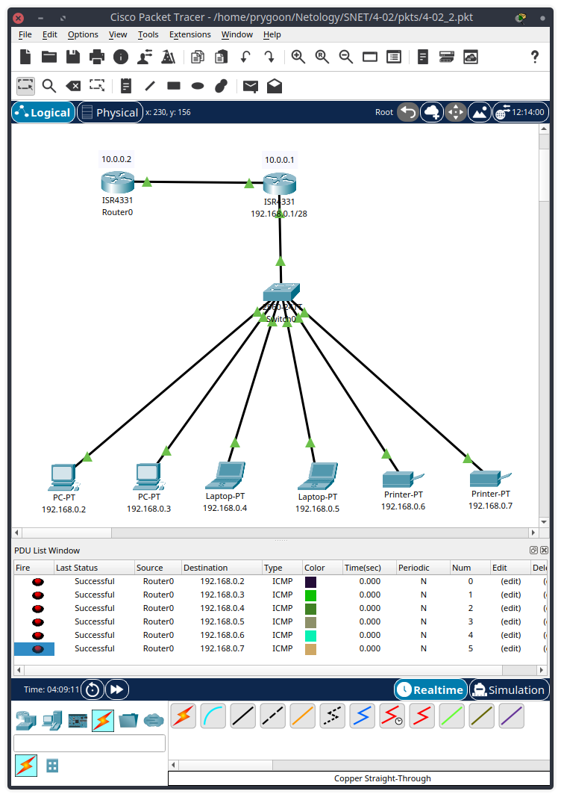
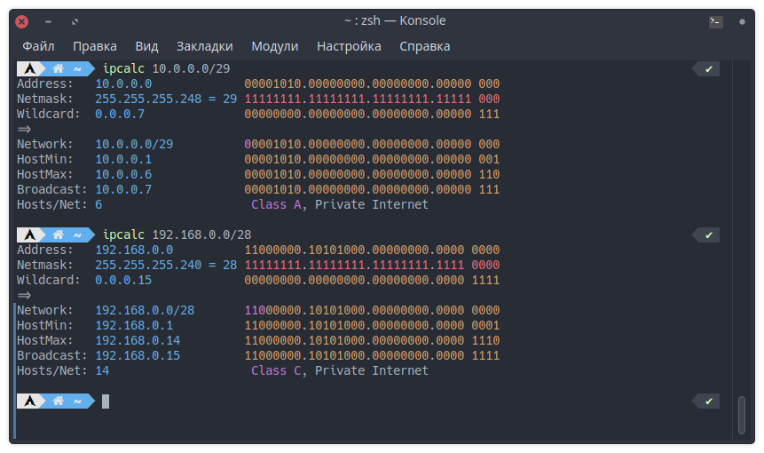
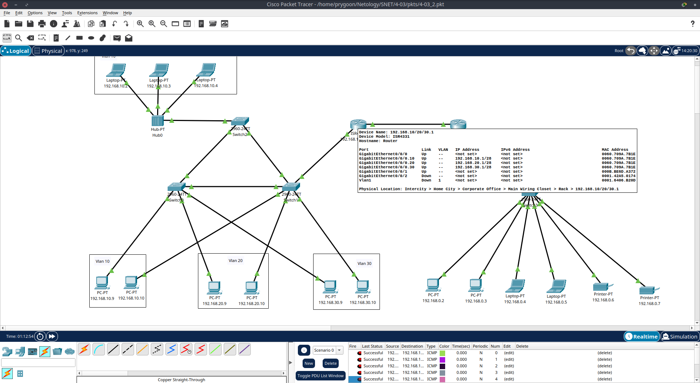
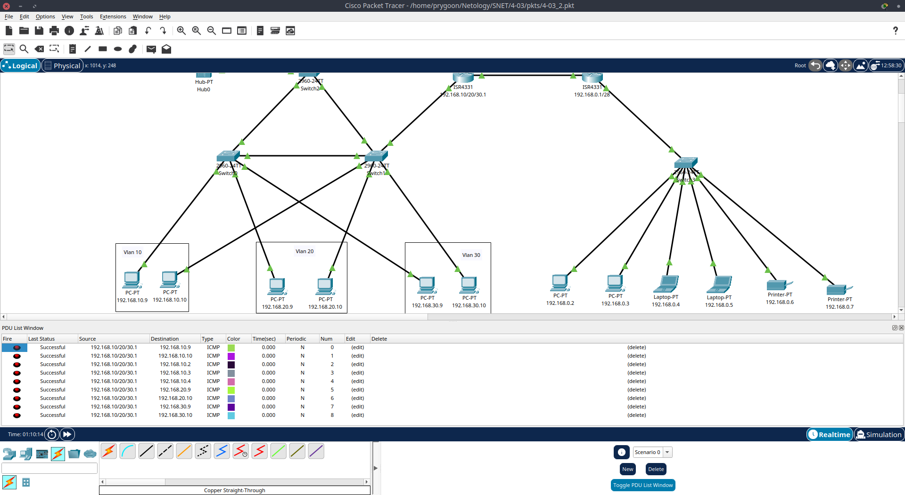
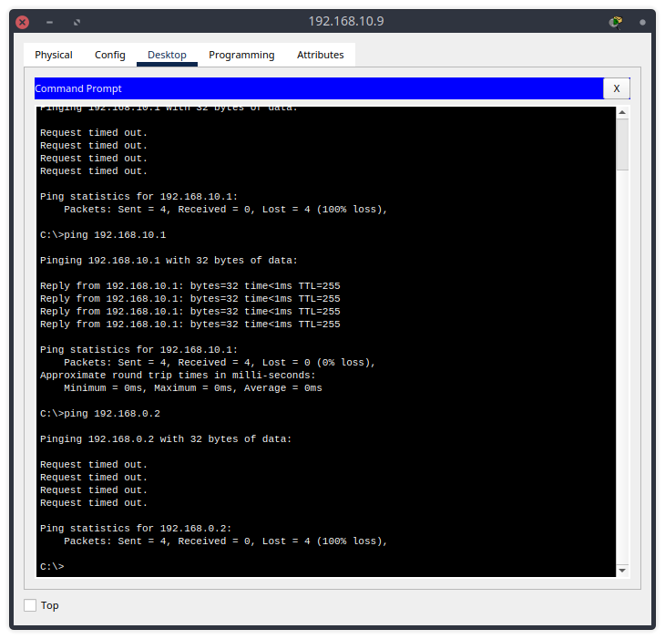
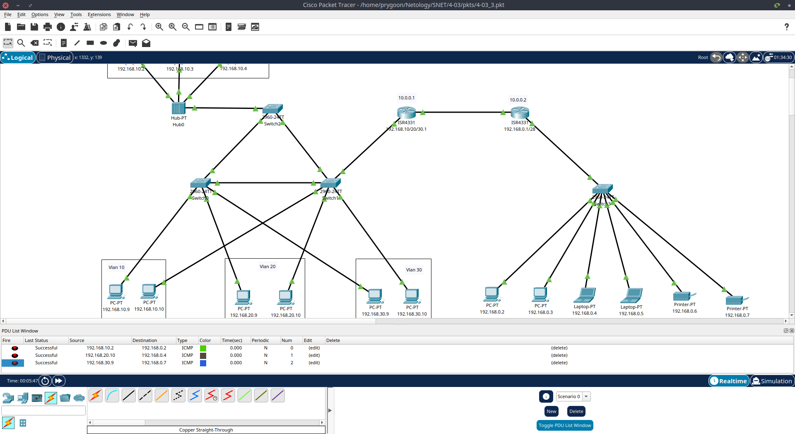

# Домашнее задание к занятию "L3-сеть"

---

## Задание 1. Сборка локальной сети

### Описание задания

Перед вами стоит задача собрать часть локальной сети главного офиса.

В вашем распоряжении две сети:

- 192.168.0.0 — предназначена для устройств главного офиса;
- 10.0.0.0 — предназначена для сетевого оборудования главного офиса.

Необходимо из каждой выделить минимальную подсеть для 4 сетевых устройств и 10 пользовательских устройств.

### Требования к результату

- Отправьте PKT-файл с выполненным заданием.
- Добавьте скриншоты с доступностью устройств между собой и ответ на вопрос.

### Процесс выполнения

1. Запустите программу Cisco Packet Tracer.
2. В программе загрузите предыдущую практическую работу.
3. Добавьте два маршрутизатора, соедините и создайте между ними сетевую связность.
4. К одному из маршрутизаторов подключите гигабитным интерфейсом ещё один коммутатор, за которым подключены два ПК, два ноутбука и два принтера. Это будет сеть главного офиса.
5. Выделите минимальную подсеть для 10 пользовательских устройств.
6. Настройте сетевые интерфейсы всех оконечных устройств так, чтобы была доступность всех со всеми.
7. Проверьте доступность каждого типа устройств с маршрутизатора, к которому они подключены, командой ping.
   
8. Какую минимальную маску необходимо выделить для устройств и почему?

   - Минимальная маска для 4 устройств сетевого оборудования - `255.255.255.248`.
   - Минимальная маска для 10 устройств главного офиса - `255.255.255.240`.
   

Полученный [PKT-файл](pkts/4-03_1.pkt).

---

## Задание 2. Подключение локальной сети

### Описание задания

Перед вами стоит задача подключить получившуюся небольшую локальную сеть к главной сети офиса.

### Требования к результату

- Отправьте PKT-файл с выполненным заданием.
- Добавьте скриншоты с доступностью устройств между собой и ответы на вопросы.

### Процесс выполнения

1. Запустите программу Cisco Packet Tracer.
2. В программе загрузите предыдущую практическую работу.
3. Маршрутизатор без устройств соедините с любым коммутатором из предыдущей практической задачи домашней работы 4.2 «L2-сеть».
4. Создайте сабинтерфейсы для каждой VLAN: 10, 20, 30.
5. Назначьте IP-адреса каждому сабинтерфейсу.
   
6. Напишите в комментариях, какую минимальную маску необходимо указать для сабинтерфейса, обоснуйте своё решение.

   - `255.255.255.240`, потому что согласно предыдущему [заданию](../4-02/4-02.md), диапазон адресов в каждой VLAN от 1 до 10, а минимальная подсеть, которая включает в себя этот диапазон - `/28`.

7. Проверьте связь маршрутизатора с конечными устройствами в каждой VLAN командой ping.
   

8. Есть ли доступность между компьютерами за разными сетями маршрутизаторов?
   

   - Доступности между компьютерами за разными сетями маршрутизаторов нет, потому что на маршрутизаторах не настроена маршрутизация.

Полученный [PKT-файл](pkts/4-03_2.pkt).

---

## Задание 3. Создание связности между сетями

### Описание задания

Перед вами стоит задача создать доступность устройств небольшой локальной сети к главной сети офиса.

### Требования к результату

- Отправьте файл .pkt с выполненным заданием.
- К выполненной задаче добавьте скриншоты с доступностью устройств между собой.

### Процесс выполнения

1. Запустите программу Cisco Packet Tracer.
2. В программе Cisco Packet Tracer загрузите предыдущую практическую работу из домашних заданий [4.2 "L2-сеть".](https://github.com/netology-code/snet-homeworks/blob/snet-18/4-02.md) и [4.3 “L3-сеть”](https://github.com/netology-code/snet-homeworks/edit/snet-18/4-03.md).
3. На маршрутизаторах добавьте статические записи маршрутизации о доступности других сетей.
4. Проверьте связь с конечного устройств за одним маршрутизатором до конечного устройства за другим маршрутизатором.
   
5. Какой вид анонса внутренней сети вы выбрали и почему?

   - Попытался настроить RIP, но почему-то он заработало. Выдавало сообщение о недоступности хоста назначения, в итоге настроил статическую маршрутизацию. Поэтому, получается, что никакой тип анонса не использовал.

Полученный [PKT-файл](pkts/4-03_3.pkt).

---
