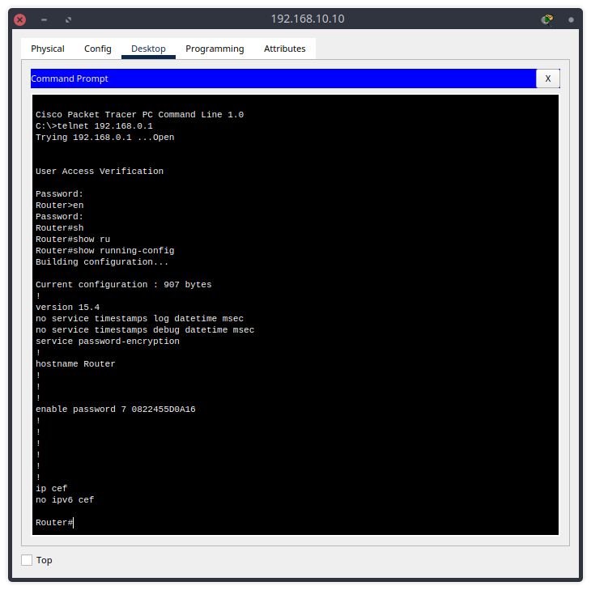

# Домашнее задание к занятию "L4-сеть"

---

## Задание 1. Настройка маршрутизатора

### Описание задания

Вам нужно создать и настроить подключение по telnet к маршрутизатору в главном офисе.

### Требования к результату

- Отправьте PKT-файл с выполненным заданием.
- Добавьте скриншоты с состояниями TCP-соединений и ответы на вопросы.

### Процесс выполнения

1. Запустите программу Cisco Packet Tracer.
2. В программе загрузите предыдущую практическую работу.
3. Настройте на маршрутизаторе главного офиса возможность подключения по telnet. Желательно указывать пароль в зашифрованном виде с помощью service password-encryption.
4. В Cisco Packet Tracer запустите режим симуляции и начните из командной строки с любого ПК главного офиса процесс подключения по telnet к маршрутизатору.
5. В режиме симуляции найдите момент, когда процесс трёхстороннего рукопожатия между ПК и маршрутизатором окончен и TCP-соединение установлено.

   
   
   

6. В командной строке выбранного ПК выполните вход на маршрутизатор с помощью ранее указанного пароля.

   

7. Посмотрите на маршрутизаторе все TCP-соединения. Сделайте скриншот.

    

8. Продолжая работать в режиме симуляции, завершите в командной строке сеанс telnet на ПК. Укажите момент, когда процесс TCP-соединения между ПК и маршрутизатором окончен.

    
    

    - В CPT, почему-то не нашёл последний `ACK` пакет от инициатора. И состояние соединения на роутере висит как `TIME_WAIT`. Возможно это баг самого CPT.
    

---

## Задание 2. Анализ трафика

### Описание задания

Вам нужно инициализировать в сети процесс отправки UDP-сообщений.

### Требование к результату

К выполненному заданию добавьте скриншот со структурой пакета и ответ на вопрос.

### Процесс выполнения

1. Запустите программу Cisco Packet Tracer.
2. В программе загрузите предыдущую практическую работу.
3. Инициализируйте в командной строке любого ПК процесс отправки UDP-пакета.
   - Инициализировали отправку UDP-пакета командой `nslookup google.com`, так как технология `DNS` использует протокол `UDP` на транспортном уровне.

   

4. Какие порты использует выбранный вами протокол или технология?

   - DNS использует `53` порт в точке назначения назначения, и динамический порт в точке отправки (в примере на скриншоте - порт `1026`).

   

Полученный [PKT-файл](pkts/4-04.pkt).

---
