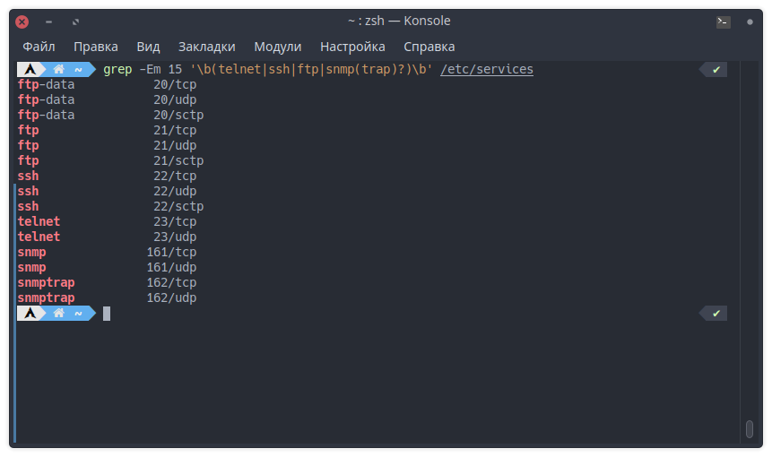
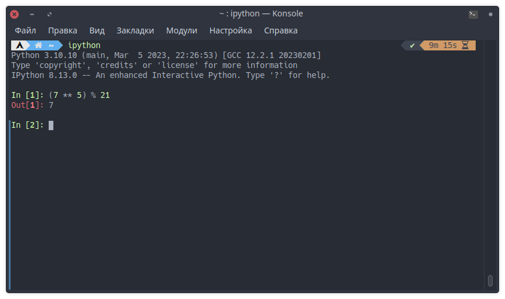

# Домашнее задание к занятию "Высокоуровневые протоколы"

------

## Задание 1

Какие порты используются протоколами:

- Telnet использует порт 23 (TCP) для установления удаленного доступа к устройству;
- SSH использует порт 22 (TCP) для безопасного удаленного доступа к устройству;
- FTP использует порт 20 (TCP) для передачи данных и порт 21 (TCP) для установления соединения;
- SNMP использует порт 161 (UDP) для получения информации от устройств и порт 162 (UDP) для получения информации о событиях;



------

## Задание 2

Какой по счету уровень модели OSI называется прикладным (`application layer`)?

Прикладной уровень (application layer) - это 7 уровень модели OSI.

*Зашифруйте ответ с помощью ключа: {5, 21}.*
Зашифруем сообщение «7» с помощью ключа {5, 21}: получаем (7 ^ 5) mod 21 = 7. 🤣


------

## Задание 3

Создайте свой корневой сертификат, добавьте его в систему.

Затем подпишите им свой сертификат.

1. **Генерируем ключ**

    ```bash
    openssl genrsa -out ca.key 2048
    ```

2. **Генерируем корневой сертификат. Поля в сертификате указываем любые.**

    ```bash
    openssl req -x509 -new -nodes -key ca.key -sha256 -days 720 -out ca.pem
    ```

3. **Сразу же сделаем сертификат в форме `crt`**

    ```bash
    openssl x509 -in ca.pem -inform PEM -out ca.crt
    ```

4. **Далее установим сертификат в систему. Ниже пример для `Ubuntu`/`Debian` систем**

    ```bash
    sudo cp ca.crt /usr/local/share/ca-certificates/myca.crt && sudo update-ca-certificates
    ```

5. **Приступим к выпуску самого сертификата:**

    5.1. **Генерируем ключи**

    ```bash
    openssl genrsa -out certificate.key 2048
    ```

    5.2. **На основе ключа создаем `CSR`**

    *Обратите внимание, что subject конечного сертификата **не должен** совпадать с subject корневого. Хотя бы в одном поле нужно указать отличающееся значение, например в common Name или email. В противном случае конечный сертификат не будет верифицироваться, поскольку будет считаться самоподписным.*

    ```bash
    openssl req -new -key certificate.key -out certificate.csr
    ```

    5.3. **Подписываем `CSR` нашим корневым сертификатом. Тем самым создаем конечный сертификат.**

    ```bash
    openssl x509 -req -in certificate.csr -CA ca.pem -CAkey ca.key -CAcreateserial -out certificate.crt -days 360 -sha256
    ```

6. **Проверяем валидность сертификата**

    *Эта проверка должна вернуть `OK`. Если вы видите `failed`, значит, где-то допущена ошибка.*

    ```bash
    openssl verify certificate.crt
    ```

    *В качестве ответа приложите снимки экрана с выводом информации о сертификатах и результатом верификации:*

    ```bash
    openssl x509 -subject -issuer -noout -in ca.pem
    openssl x509 -subject -issuer -noout -in certificate.crt
    openssl verify certificate.crt
    ```

    

------
