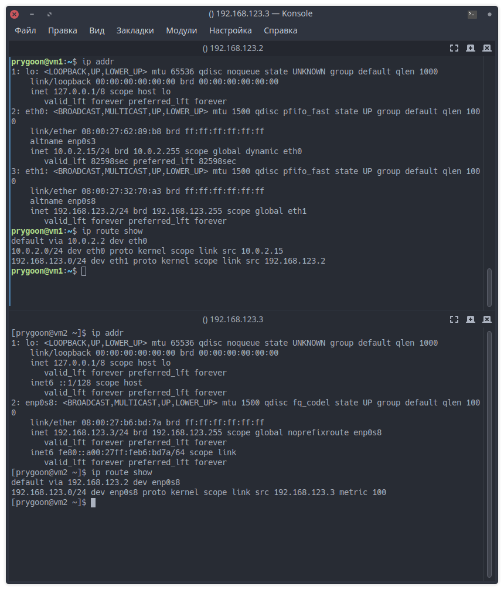
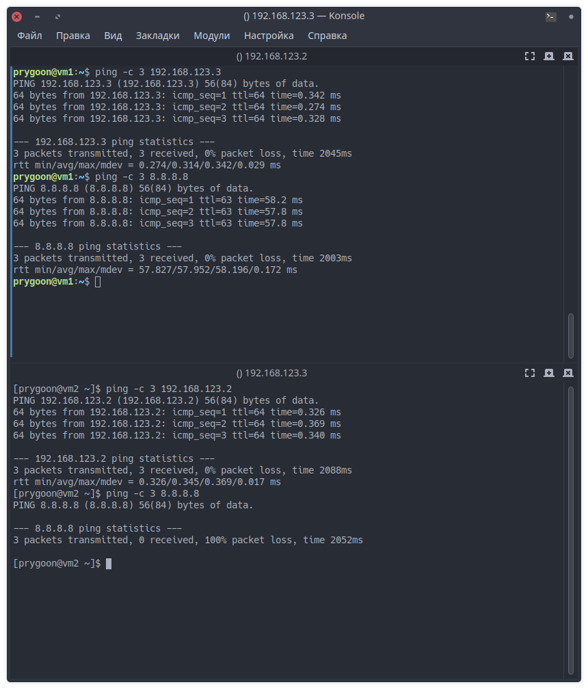
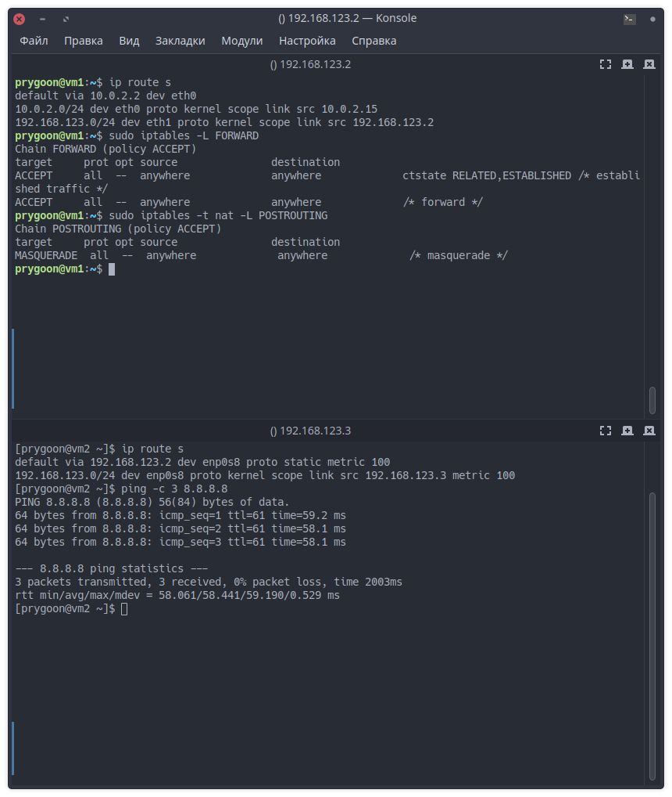
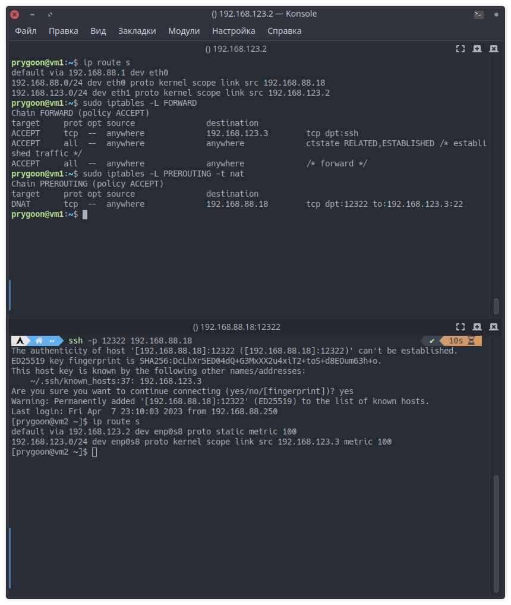

# Домашнее задание к занятию "Сеть и сетевые протоколы: Firewall"

---

## Задание 1. Создание виртуального окружения и настройка сетевых интерфейсов

### Описание задания

Перед вами стоит задача создать две виртуальные машины с операционной системой Debian и настроить управление трафиком.

### Требование к результату

Вы должны создать и настроить две виртуальные машины с операционной системой Debian. К выполненной задаче добавьте скриншоты настроек IP-адресов интерфейсов, таблиц маршрутизации, конфигурации файервола и результатов выполнения всех упомянутых проверок ping.

### Процесс выполнения

1. Запустите программу VirtualBox.
2. В программе VirtualBox создайте две виртуальные машины с Debian, назовите их vm1 и vm2
3. В VirtualBox создайте виртуальную сеть 192.168.123.0/24
4. В VirtualBox настройте сетевые интерфейсы vm1 так, чтобы один интерфейс имел доступ в интернет (bridge или NAT), а второй интерфейс смотрел в виртуальную сеть 192.168.123.0/24
5. В VirtualBox настройте сетевой интерфейс vm2 так, чтобы он смотрел только в виртуальную сеть 192.168.123.0
6. Для vm1: настройте статический IP адрес у интерфейса смотрящего в сеть 192.168.123.0 (адрес в сети 123.0 выберите на своё усмотрение). Настройте IP-адрес интерфейса смотрящего в вашу локальную сеть так, проверьте чтобы была доступность по ICMP c vm1 до 8.8.8.8.
7. Для vm2: настройте статический IP адрес у интерфейса смотрящего в сеть 192.168.123.0 (адрес в сети 123.0 выберите на своё усмотрение), шлюзом укажите IP vm1 из сети 192.168.123.0

   

8. Проверьте доступность по ICMP:

   - vm2 с vm1 по IP
   - vm1 с vm2 по IP

9. Приложите скриншоты результата.

   

10. Настройте пересылку трафика на vm1, чтобы с vm2 можно было отправить ICMP-запросы на 8.8.8.8 и приложите скриншот результата.
    - Включаем ip_forwardring командой:

    ```bash

    sudo sysctl -w net.ipv4.ip_forward=1
    ```

    - Добавляем правило в цепочку FORWARD, которое разрешает передачу данных из установленного или связанного соединения следующей командой:

    ```bash
    sudo iptables -A FORWARD -j ACCEPT -m conntrack --ctstate ESTABLISHED,RELATED -m comment --comment "established traffic"
    ```

    - Добавляем правило в цепочку FORWARD. Ключ `-j ACCEPT` указывает, что если пакет соответствует данным критериям, он должен быть передан дальше. Ключ `-i eth1` указывает, что пакет должен приходить через сетевой интерфейс `eth1`, а ключ `-o eth0` указывает, что пакет должен уходить через сетевой интерфейс `eth0` следующей командой командой:

    ```bash
    sudo iptables -A FORWARD -j ACCEPT -i eth1 -o eth0 -m comment --comment "forward"
    ```

    - Добавляем правило в цепочку POSTROUTING таблицы nat. Ключ `-j` указывает, что если пакет соответствует данным критериям, он должен быть передан на дальнейшую обработку (masquerade). Ключ `-o eth0` указывает, что пакет должен уходить через сетевой интерфейс `eth0` следующей командой:

    ```bash
    sudo iptables -t nat -A POSTROUTING -o eth0 -j MASQUERADE -m comment --comment "masquerade"
    ```

    

---

## Задание 2. Настройка проброса портов

### Описание задания

Перед вами стоит задача настроить проброс портов из локальной сети компьютера в виртуальную сеть.

### Требование к результату

К выполненной задаче добавьте скриншот настроек и успешное подключение через ssh.

### Процесс выполнения

1. Запустите программу VirtualBox.
2. В программе VirtualBox используйте результат предыдущей практической работы.
3. Настройте проброс портов из локальной сети компьютера с VirtualBox через vm1 порт 12322 в виртуальную сеть VirtualBox на 22 порт vm2.
   - Добавляем правило в таблицу NAT для изменения адреса назначения и порта назначения для всех TCP пакетов, которые приходят на адрес назначения 192.168.88.18 через порт 12322. В результате адрес назначения внутренней сети будет изменен на IP-адрес 192.168.123.3 и порт 22.

   ```bash
   sudo iptables -t nat -A PREROUTING -d 192.168.88.18 -p tcp --dport 12322 -j DNAT --to-destination 192.168.123.3:22
   ```

   - Добавляем правило в таблицу фильтрации пакетов, которое позволяет передавать все TCP-пакеты с портом назначения 22, которые приходят на интерфейс eth0 и адрес назначения 192.168.123.3, на выходной интерфейс eth1

   ```bash
   sudo iptables -I FORWARD 1 -i eth0 -o eth1 -d 192.168.123.3 -p tcp -m tcp --dport 22 -j ACCEPT
   ```

4. Подключитесь к vm2 по ssh через Putty как было показано на уроке.

   

---
