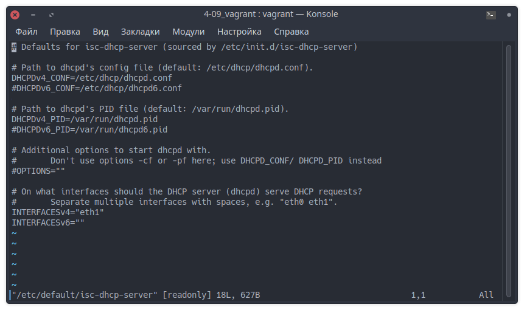
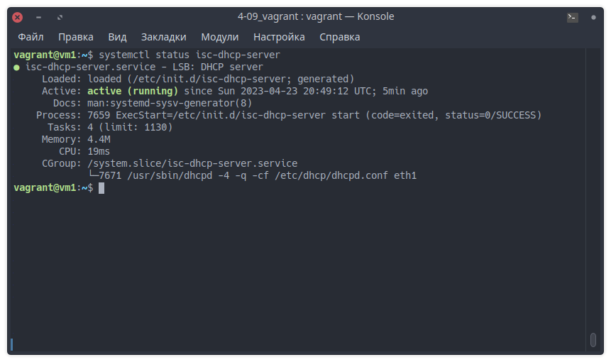

# Домашнее задание к занятию "DHCP, PXE"

---

## Задание 1

Для чего служит протокол `DHCP`?

Может ли работать сеть без `DHCP-сервера`?

- DHCP-протокол применяется для динамической настройки сетевых параметров устройств, включая IP-адрес, маску подсети, шлюз по умолчанию и DNS-серверы.
Это позволяет упростить процесс управления сетью и помогает избежать конфликтов IP-адресов.

- Сеть может работать без DHCP-сервера при использовании статической настройки IP-адресов. Однако это требует более тщательного управления, так как каждому устройству вручную назначается IP-адрес и другие параметры сети.

---

## Задание 2

На каком порту/портах работает `DHCP`?

- Протокол DHCP использует порты UDP 67 и UDP 68. По умолчанию запросы от клиента делаются к серверу на порт 67, сервер в свою очередь отвечает клиенту на порт 68.

---

## Задание 3

Какие настройки можно произвести используя опции?

Назовите 5.

1. subnet-mask - маска подсети
2. routers - шлюз по умолчанию
3. domain-name-servers - DNS-серверы
4. domain-name - доменное имя
5. lease-time - время аренды IP-адреса

---

## Задание 4

Сконфигурируйте сервер `DHCP`.

Настройка `/etc/default/isc-dhcp-server`:

Конфигурационный [файл](files/dhcpd.conf) `/etc/dhcp/dhcpd.conf`.

Статус службы:

---
