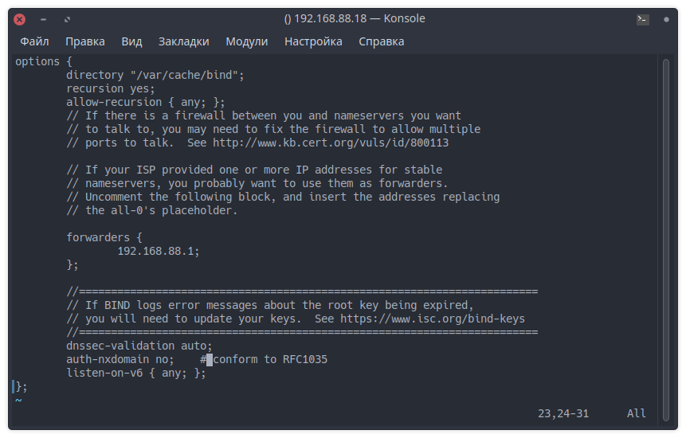
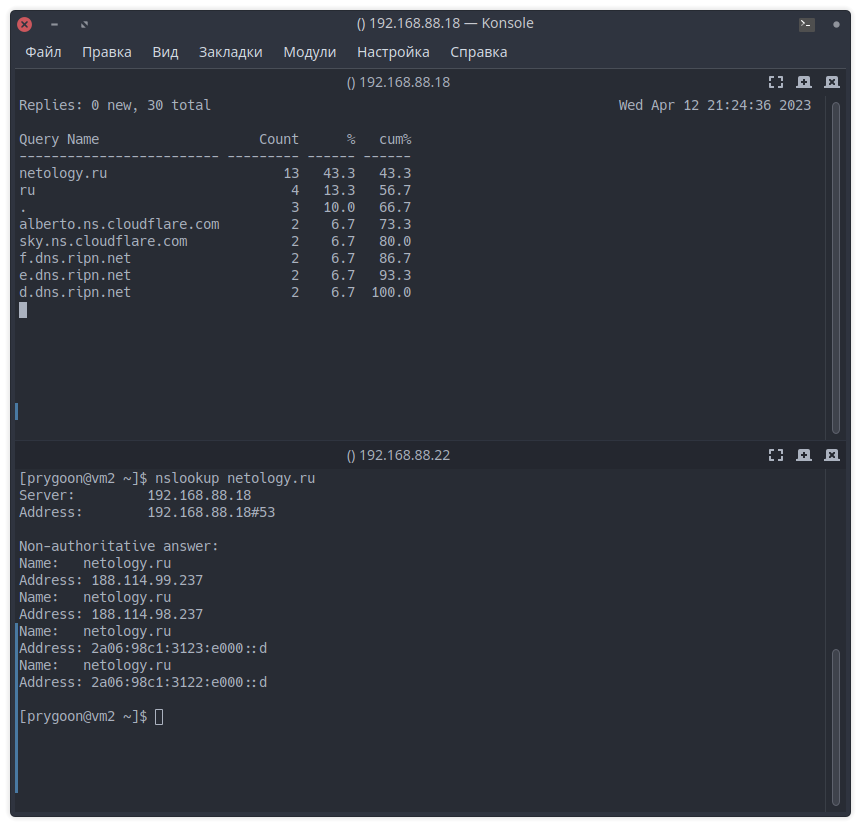

# Домашнее задание к занятию "DNS"

---

## Задание 1

Может ли компьютер работать без `DNS`? Будет ли работать сеть если в ней нет `DNS-сервера`?

- Компьютер и сеть могут работать без DNS, но пользователи будут вынуждены использовать IP-адреса вместо доменных имен при доступе к веб-сайтам и другим ресурсам в сети.

---

## Задание 2

Кто выдает DNS имена?

- DNS (Domain Name System) имена выдаются регистраторами доменных имен. Регистраторы доменных имен - это компании, которые зарегистрированы в ICANN (Internet Corporation for Assigned Names and Numbers) и имеют право на продажу доменных имен в определенных доменных зонах (например, .com, .org, .net и т.д.).

---

## Задание 3

Где в Linux настраивается DNS-клиент в простейшем случае?

- В Linux настройка DNS-клиента в простейшем случае выполняется в файле /etc/resolv.conf. В этом файле указываются DNS-серверы, которые будут использоваться клиентом для разрешения DNS-имен.
Например:

  ```conf
  nameserver 8.8.8.8
  nameserver 8.8.4.4
  ```

- После этого DNS-клиент будет использовать указанные DNS-серверы для разрешения DNS-имен. Некоторые программы для управления сетью, например NetworkManager, могут вносить изменения в файл /etc/resolv.conf. В таком случае, рекомендуется использовать инструменты управления сетью, такие как NetworkManager, для настройки DNS-клиента.

---

## Задание 4

Для чего служит ресурсная DNS запись типа `MX`?

- Ресурсная DNS-запись типа MX (Mail Exchange) служит для указания почтового сервера, который обрабатывает электронную почту для домена.

---

## Дополнительные задания (со звездочкой*)

Эти задания дополнительные (не обязательные к выполнению) и никак не повлияют на получение вами зачета по этому домашнему заданию. Вы можете их выполнить, если хотите глубже и/или шире разобраться в материале.

## Задание 5*

Настройте кэширующий DNS сервер `BIND`.

С любого клиента отправьте запрос на преобразование адреса `netology.ru`.

С помощью утилиты `dnstop` посмотрите какие входящие и исходящие запросы обрабатывались DNS-сервером.

- Конфиг named:

  

- Результат:

  
