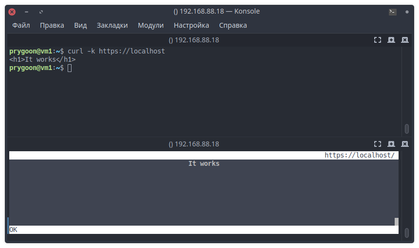
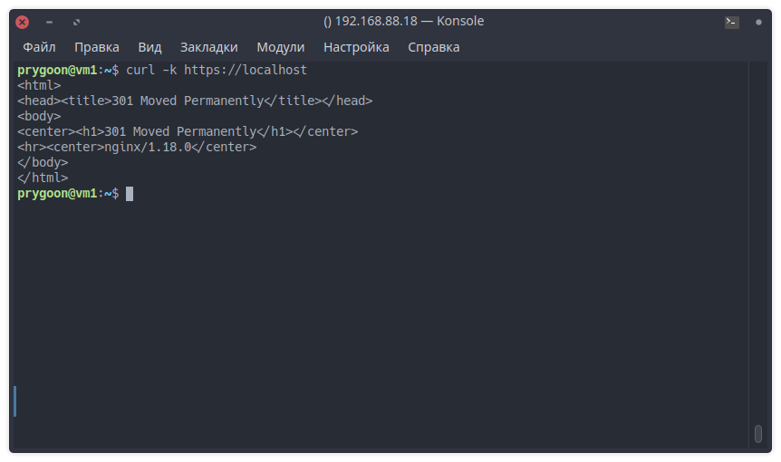

# Домашнее задание к занятию "HTTP/HTTPS"

------

## Задание 1

Какие коды ответов HTTP лучше соответствуют описанным ситуациям?

- Данная страница не найдена: 404 Not Found;
- Страница была перенесена на новый сайт: 301 Moved Permanently;
- Ресурс удален: 410 Gone;
- Пользователь не авторизован для просмотра страницы: 401 Unauthorized;
- Превышен лимит запросов от пользователя: 429 Too Many Requests.

## Задание 2

1. Установите Nginx.
`sudo apt-get install nginx`

2. Сгенерируйте сертификат для него указав `localhost` в качестве `CN`.
`sudo openssl req -x509 -nodes -newkey rsa:4096 -keyout /etc/nginx/cert.key -out /etc/nginx/cert.pem -days 365`

3. Отредактируйте модуль `http` в файле `/etc/nginx/nginx.conf`.

```nginx
http {
    gzip on;
    server {
        listen 80 default_server;
        root   /var/www/public;
        listen  443 ssl http2 default_server;
        server_name  localhost;
        ssl_certificate  /etc/nginx/cert.pem;
        ssl_certificate_key /etc/nginx/cert.key;
        ssl_protocols   TLSv1 TLSv1.1 TLSv1.2;
        ssl_ciphers   HIGH:!aNULL:!MD5;
        location / {
            index index.html;
        }
    }
}
```

4. Создайте файл `/var/www/public/index.html` c содержимым.

```html
<h1>It works</h1>
```

5. Зайдите на страницу в браузере, пропустив сообщение о неработающем сертификате.



------

## Задание 3

Измените конфигурацию сервера добавив переадресацию c Вашего сервера на сайт `netology.ru`.

```nginx
location / {
  return 301 https://netology.ru;
}
```



------
