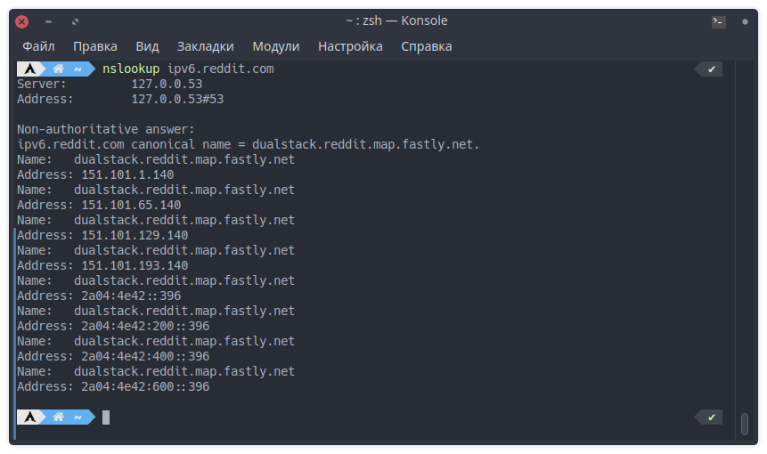

# Домашнее задание к занятию "IPv6"

---

## Задание 1

Какая нотация используется для записи IPv6-адресов:

- какие и сколько символов?
- какие разделители?

IPv6-адреса записываются в шестнадцатеричной системе счисления, используя 8 блоков, разделенных двоеточием. Каждый блок состоит из 4 символов. Если возникают последовательности нулей в блоках, то их можно заменить на два двоеточия, но такое представление допустимо только один раз в каждом адресе.

---

## Задание 2

Какой адрес используется в IPv6 как `loopback`?

В IPv6 адрес loopback обозначается как ::1.

---

## Задание 3

Что такое `Unicast`, `Multicast`, `Anycast` адреса?

Unicast адресация описывает передачу пакета только одному узлу в сети. Этот тип адресации используется для точечной доставки данных.

Multicast адресация описывает передачу пакета группе узлов в сети, у которых есть одинаковый адрес. Этот тип адресации используется для одновременной доставки данных на несколько устройств.

Anycast - передача единственному узлу из группы когда есть
варианты прохождения запроса; задача выбрать ближайший.

Для IPv6 существуют следующие префиксы для каждого типа адресации:

- Unicast: без префиксов

- Multicast: ff00::/8

- Anycast: 2000::/3

---

## Задание 4

Используя любую консольную утилиту в Linux, получите IPv6-адрес для какого либо ресурса.

---

## Задание 5

- Как выглядят IPv6-адреса, которые маршрутизируются в интернете?
- Как выглядят локальные IPv6 адреса?

IPv6-адреса, которые маршрутизируются в интернете, имеют глобальный префикс (первые 48 бит), который идентифицирует маршрутизируемую организацию, и локальную часть, которая идентифицирует конкретное устройство в организации. Пример глобального IPv6-адреса: 2001:0db8:85a3::8a2e:0370:7334.

Локальные IPv6-адреса используются в локальных сетях (LAN) и не маршрутизируются в интернете. Они имеют префикс FE80::/10 и обычно состоят из двух частей: идентификатора подсети и идентификатора устройства в этой подсети. Пример локального IPv6-адреса: FE80::1.
