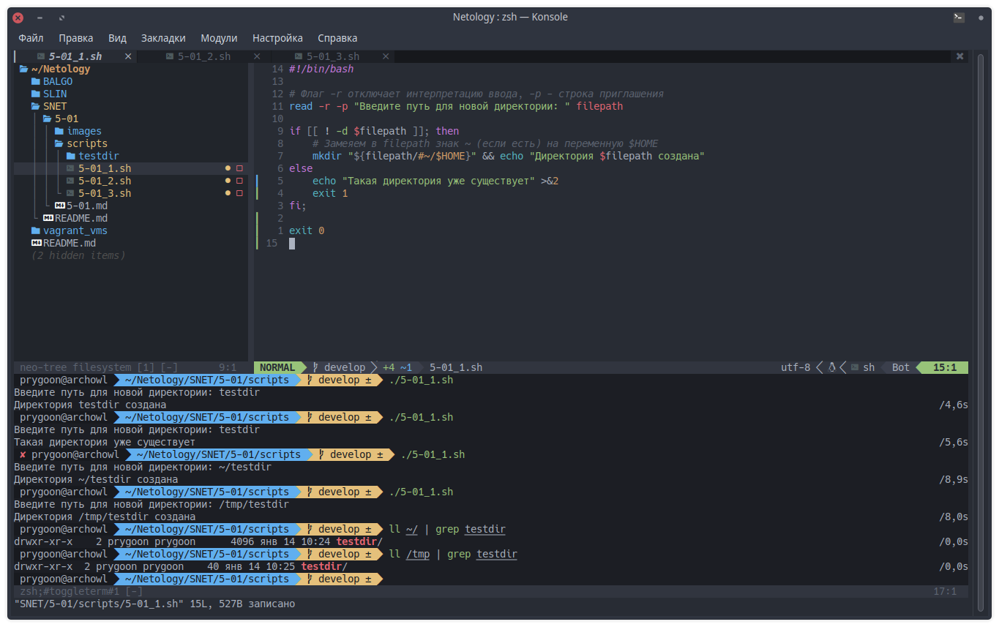
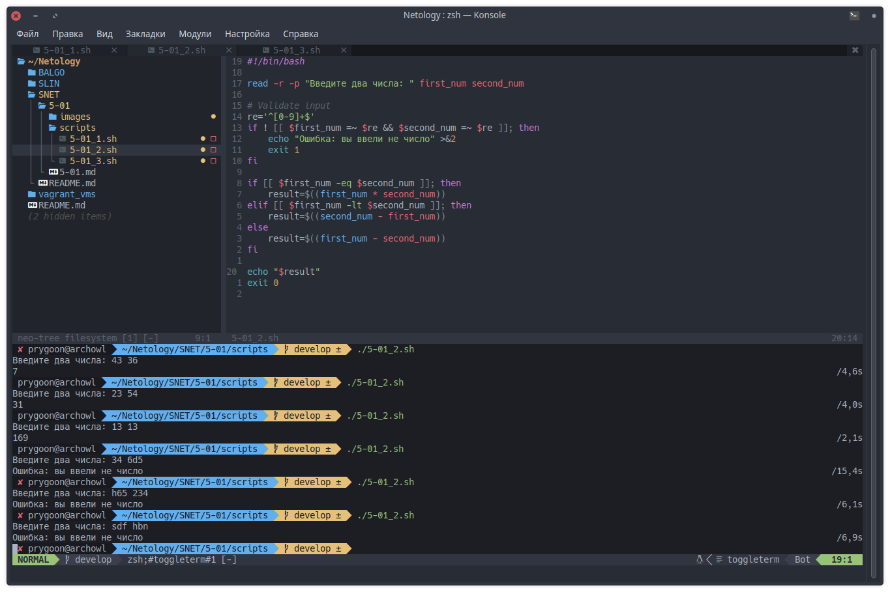
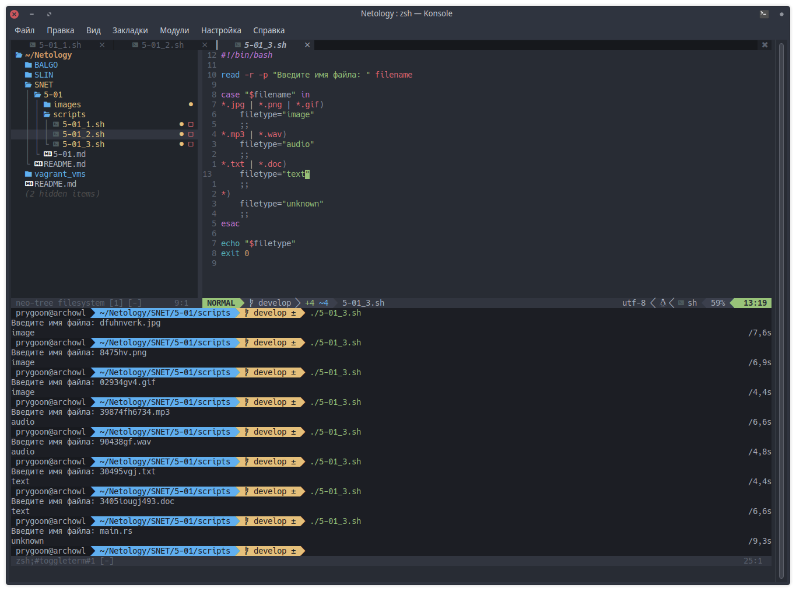

# Домашнее задание к занятию "Переменные и условные операторы" 

------
### Задание 1.

Напишите скрипт, который при запуске спрашивает у пользователя путь до директории и создает ее при условии, что ее еще не существует. 

Если директория существует – пользователю выводится сообщение, что директория существует.

```bash
#!/bin/bash

# Флаг -r отключает интерпретацию ввода, -p - строка приглашения
read -r -p "Введите путь для новой директории: " filepath

if [[ ! -d $filepath ]]; then
    # Замеяем в filepath знак ~ (если есть) на переменную $HOME
    mkdir "${filepath/#~/$HOME}" && echo "Директория $filepath создана"
else
    echo "Такая директория уже существует" >&2
	exit 1
fi;

exit 0

```



------
### Задание 2.

Напишите скрипт:
1. При запуске скрипта пользователь вводит два числа.
2. Необходимо вычесть из большего числа меньшее и вывести результат в консоль.
3. Если числа равны – умножить их друг на друга (или возвести в квадрат одно из чисел) и вывести результат в консоль.


```bash
#!/bin/bash

read -r -p "Введите два числа: " first_num second_num

# Validate input
re='^[0-9]+$'
if ! [[ $first_num =~ $re && $second_num =~ $re ]]; then
    echo "Ошибка: вы ввели не число" >&2
    exit 1
fi

if [[ $first_num -eq $second_num ]]; then
    result=$((first_num * second_num))
elif [[ $first_num -lt $second_num ]]; then
    result=$((second_num - first_num))
else
    result=$((first_num - second_num))
fi

echo "$result"
exit 0

```


------
### Задание 3.

Напишите скрипт с использованием оператора `case`:
1. При запуске скрипта пользователь вводит в консоль имя файла с расширением, например 123.jpg или track.mp3.
2. Необходимо сообщить пользователю тип файла:
- Если jpg, gif или png – вывести слово «image»
- Если mp3 или wav – вывести слово «audio»
- Если txt или doc – вывести слово «text»
- Если формат не подходит под заданные выше – написать «unknown»

```bash
#!/bin/bash

read -r -p "Введите имя файла: " filename

case "$filename" in
*.jpg | *.png | *.gif)
	filetype="image"
    ;;
*.mp3 | *.wav)
    filetype="audio"
    ;;
*.txt | *.doc)
    filetype="text"
    ;;
*)
    filetype="unknown"
    ;;
esac

echo "$filetype"
exit 0

```


