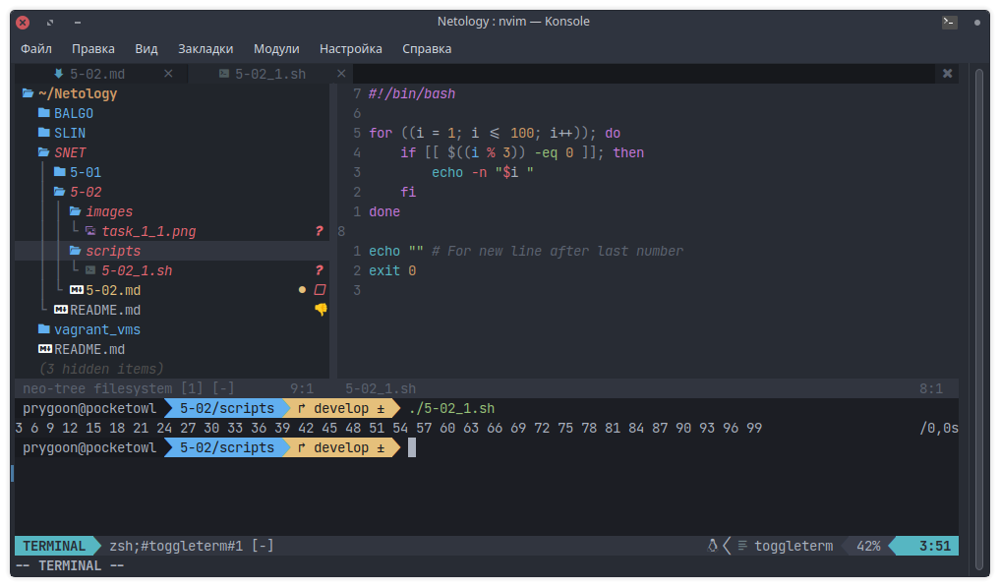
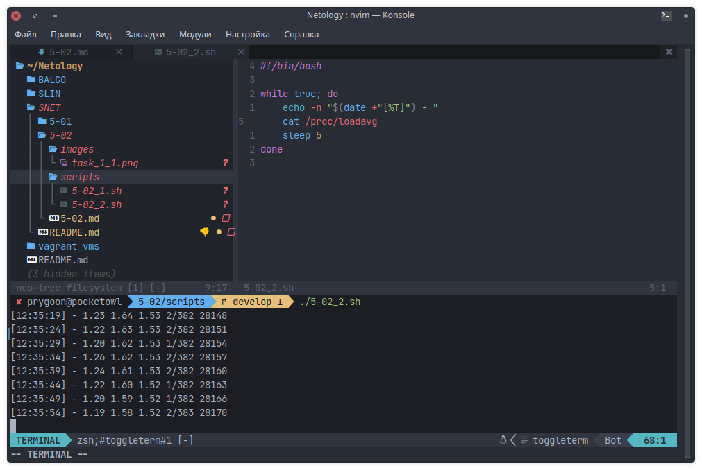
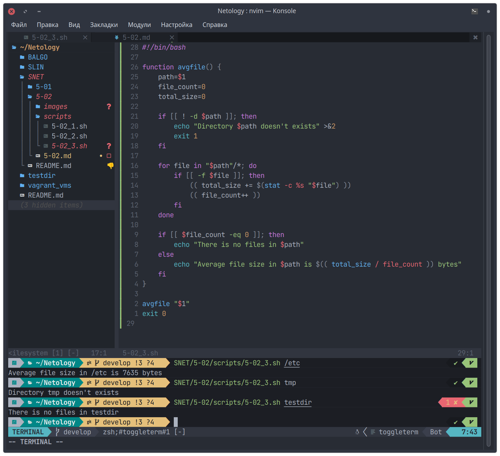

# Домашнее задание к занятию "Циклы и функции."

## Задание 1

Напишите скрипт.

Скрипт должен выводить на экран все числа от 1 до 100, которые делятся на 3.

Для выполнения задания используйте цикл.

```bash
#!/bin/bash

for ((i = 1; i <= 100; i++)); do
    if [[ $((i % 3)) -eq 0 ]]; then
        echo -n "$i "
    fi
done

echo "" # For new line after last number
exit 0

```



---

## Задание 2

Напишите скрипт, который каждые 5 секунд будет выводить на экран текущее время и
содержимое файла `/proc/loadavg`.

Для выполнения задания используйте цикл.

```bash
#!/bin/bash

while true; do
    echo -n "$(date +"[%T]") - "
    cat /proc/loadavg
    sleep 5
done

```



---

## Задание 3

Напишите функцию для подсчета среднего размера файла в директории.

- путь к директории должен передаваться параметром, например `avgfile /home/username`;
- функция должна проверять, что такая директория существует, подсчитывать и
  выводить на экран средний размер файла в ней;
- при подсчете не нужно учитывать поддиректории и символьные ссылки, считать
  только средний размер файлов в заданной директории.
- для вывода среднего достаточно использовать целочисленное значение
  (стандартное деление в bash)

```bash
#!/bin/bash

function avgfile() {
    path=$1
    file_count=0
    total_size=0

    if [[ ! -d $path ]]; then
        echo "Directory $path doesn't exists" >&2
        exit 1
    fi

    for file in "$path"/*; do
        if [[ -f $file ]]; then
            (( total_size += $(stat -c %s "$file") ))
            (( file_count++ ))
        fi
    done

    if [[ $file_count -eq 0 ]]; then
        echo "There is no files in $path"
    else
        echo "Average file size in $path is $(( total_size / file_count )) bytes"
    fi
}

avgfile "$1"
exit 0
```


