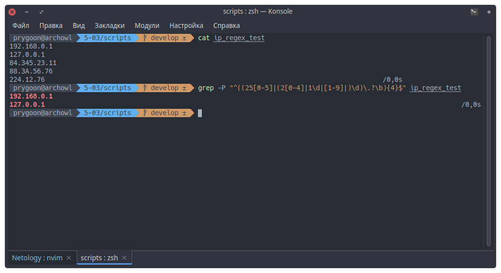
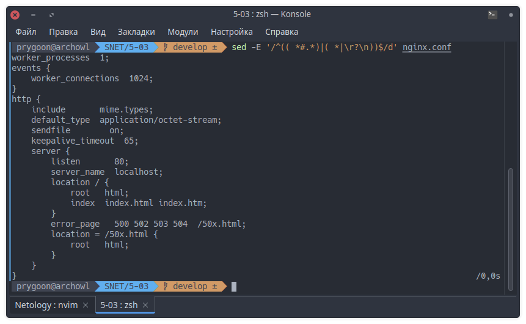
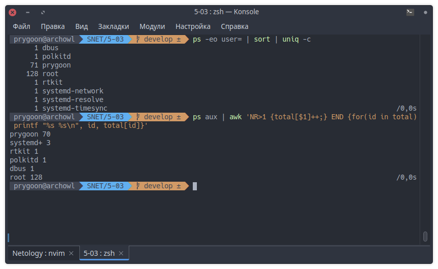
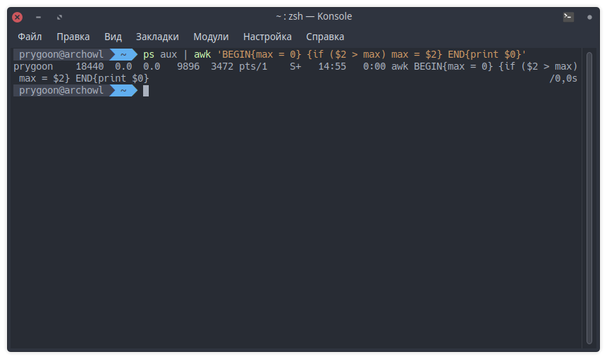

# Домашнее задание к занятию "Regexp и его использование для синтаксического анализа"

## Задание 1

Напишите регулярное выражение для проверки является ли строка `IPv4` адресом.

```regexp
^((25[0-5]|(2[0-4]|1\d|[1-9]|)\d)\.?\b){4}$
```

Расшифровка:  
Ищем 4 группы, имеющих на конце 0 или 1 точку или же являющихся концом слова.  
В каждую группу входят: числа от 250 до 255 `(25[0-5])`, или числа
от 200 до 249 `((2[0-4])\d)`, или числа от 100 до 199 `((1\d)\d)`,
или числа от 0 до 99 `(([1-9]|)\d)`.

Тестируем:

```bash
# -P for Perl-compatible regular expression (PCRE)
# Чтобы не писать '[[:digit:]]' или '[0-9]' вместо '\d'
grep -P '^((25[0-5]|(2[0-4]|1\d|[1-9]|)\d)\.?\b){4}$' ip_regex_test
```



---

## Задание 2

В Вашей конфигурации Nginx скопилось много неиспользуемых сегментов и становится
сложно его читать.

Используя `sed` удалите все пустые строки и комментарии в конфигурации Nginx.

Попробуйте сделать это одним запуском.

```bash
sed -E '/^(( *#.*)|( *|\r?\n))$/d' nginx.conf
```



---

## Задание 3

Используя `awk` и `ps aux` соберите информацию о:

- количестве процессов для каждого пользователя;

Без использования `awk`:

```bash
ps -eo user= | sort | uniq -c
```

C использованием `awk`:

```bash
ps aux | awk 'NR>1 {total[$1]++;} END {for(id in total) printf "%s %s\n", id, total[id]}'
```



- процессе с самым большим PID;

```bash
ps aux | awk 'BEGIN{max = 0} {if ($2 > max) max = $2} END{print $0}'
```



---
