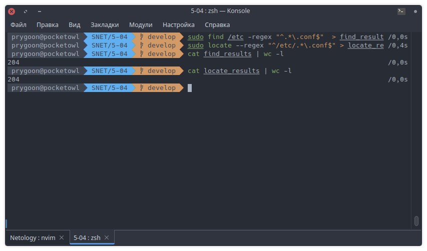
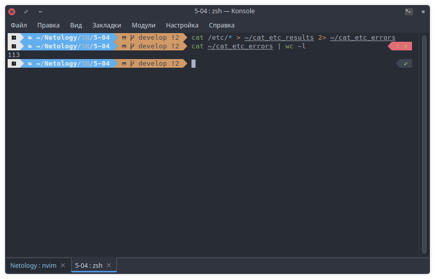
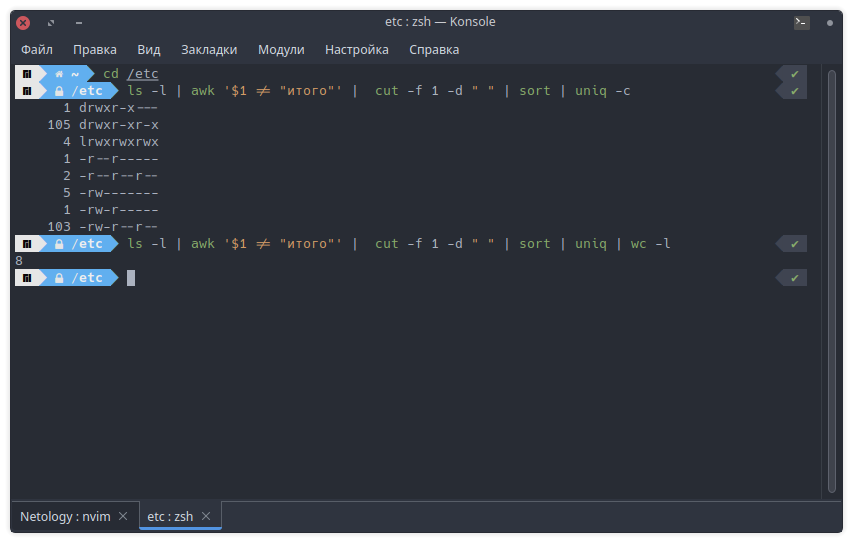

# Домашнее задание к занятию "Работа с текстовыми утилитами"

## Задание 1

- Найдите все файлы с расширением `.conf` в /etc сначала с помощью команды `find`,
  а потом с помощью команды `locate`;
  а потом с помощью команды `locate`;

- Перенаправьте результаты работы каждой команды в разные файлы;

```bash
find /etc -regex "^.*\.conf$"  > find_results
```

```bash
locate --regex "^/etc/.*\.conf$" > locate_results
```

- Подсчитайте количество найденных файлов в каждом случае с помощью `wc`.

```bash
cat find_results | wc -l
```

```bash
cat locate_results | wc -l
cat locate_results | wc -l
```



---
---

## Задание 2

- Выведите с помощью `cat` содержимое всех файлов в директории /etc `cat /etc/*`;
- Направьте ошибки в отдельный файл в вашей домашней директории;
- Стандартный поток вывода направьте в другой файл;

```bash
cat /etc/* > ~/cat_etc_results 2> ~/cat_etc_errors
```

- Подсчитайте, сколько объектов не удалось прочитать.

```bash
cat ~/cat_etc_errors | wc -l
```



---
---

## Задание 3

- Перенаправьте результат работы команды `ls -l` в каталоге с большим
  количеством файлов в утилиту `cut`, чтобы отобразить только права доступа к файлам;
- Отправьте в конвейере этот вывод на `sort` и `uniq`, чтобы отфильтровать все
  повторяющиеся строки;
- Уберите из подсчета строку `total`;
- С помощью `wc` подсчитайте различные типы разрешений в этом каталоге.

```bash
ls -l | awk '$1 != "итого"' |  cut -f 1 -d " " | sort | uniq | wc -l
```



---

## Дополнительные задания (со звездочкой\*)

Эти задания дополнительные (не обязательные к выполнению) и никак не повлияют
на получение вами зачета по этому домашнему заданию. Вы можете их выполнить,
если хотите глубже и/или шире разобраться в материале.

## Задание 4

В ОС Linux скрытыми файлами считаются те, имена которых начинаются с точки.

Сколько скрытых файлов в вашем домашнем каталоге?
