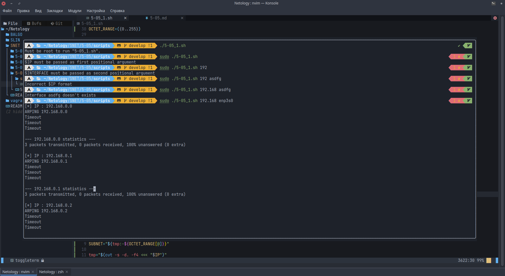
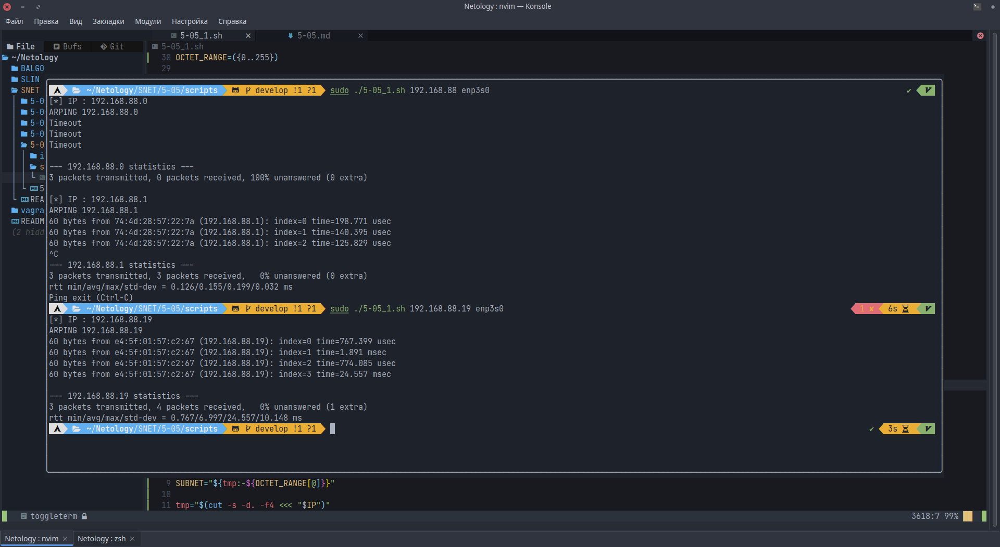
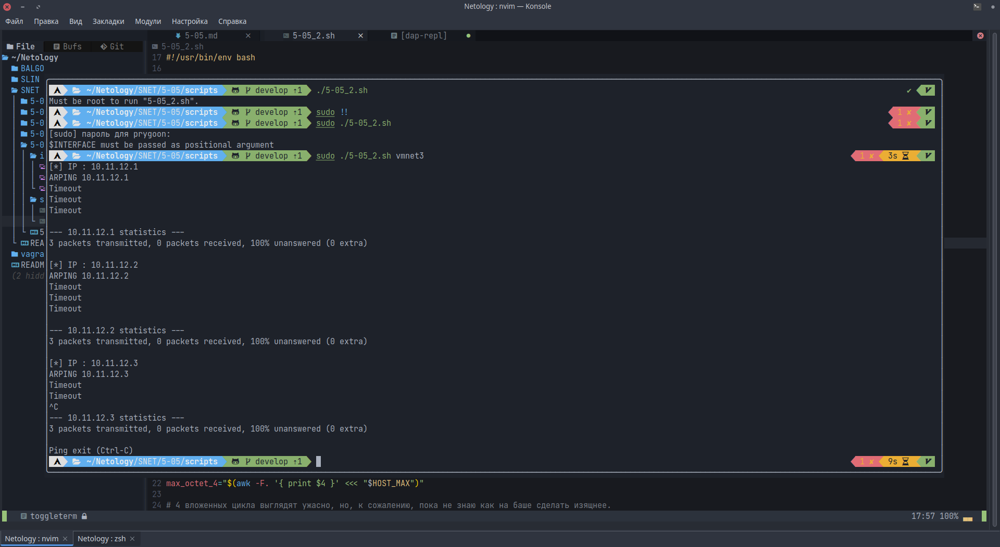

# Домашнее задание к занятию "Разбор скриптов и и их написание"

---

## Задание 1

Дан скрипт:

```bash
#!/bin/bash
PREFIX="${1:-NOT_SET}"
INTERFACE="$2"

[[ "$PREFIX" = "NOT_SET" ]] && {
    echo "\$PREFIX must be passed as first positional argument"
    exit 1;
}

if [[ -z "$INTERFACE" ]]; then
    echo "\$INTERFACE must be passed as second positional argument"
    exit 1
fi

for SUBNET in {1..255}
do
   for HOST in {1..255}
   do
       echo "[*] IP : ${PREFIX}.${SUBNET}.${HOST}"
       arping -c 3 -I "$INTERFACE" "${PREFIX}.${SUBNET}.${HOST}" 2> /dev/null
   done
done
```

Измените скрипт так, чтобы:

- для ввода пользователем были доступны все параметры. Помимо существующих
  PREFIX и INTERFACE, сделайте возможность задавать пользователю SUBNET и HOST;
- скрипт должен работать корректно в случае передачи туда только PREFIX и INTERFACE
- скрипт должен сканировать только одну подсеть, если переданы параметры PREFIX,
  INTERFACE и SUBNET
- скрипт должен сканировать только один IP-адрес, если переданы PREFIX, INTERFACE,
  SUBNET и HOST
- не забывайте проверять вводимые пользователем параметры с помощью регулярных
  выражений и знака `~=` в условных операторах
- проверьте, что скрипт запускается с повышенными привилегиями и сообщите
  пользователю, если скрипт запускается без них

Итоговый [скрипт](scripts/5-05_1.sh):

```bash
#!/usr/bin/env bash

ROOTUSER_NAME=root
OCTET_RANGE=({0..255})

username=$(id -nu)
if [ "$username" != "$ROOTUSER_NAME" ]; then
    echo "Must be root to run \"$(basename "$0")\"."
    exit 1
fi

trap 'echo "Ping exit (Ctrl-C)"; exit 1' 2

IP="$1"
INTERFACE="$2"

if [[ -z "$IP" ]]; then
    echo "\$IP must be passed as first positional argument" >&2
    exit 1;
fi

if [[ -z "$INTERFACE" ]]; then
    echo "\$INTERFACE must be passed as second positional argument" >&2
    exit 1
fi

ip_re='^((25[0-5]|(2[0-4]|1[0-9]|[1-9]|)[0-9])\.?\b){2,4}$'

if ! [[ $IP =~ $ip_re ]]; then
    echo "Incorrect \$IP format" >&2
    exit 1
fi

inteface_array=$(ls /sys/class/net)
if [[ ! $inteface_array =~ $INTERFACE ]]; then
    echo "Interface $INTERFACE doesn't exists" >&2
    exit 1
fi

PREFIX=$(cut -s -d. -f1,2 <<< "$IP")

tmp="$(cut -s -d. -f3 <<< "$IP")"
SUBNET="${tmp:-${OCTET_RANGE[@]}}"

tmp="$(cut -s -d. -f4 <<< "$IP")"
HOST="${tmp:-${OCTET_RANGE[@]}}"

for SUBNET in $SUBNET; do
    for HOST in $HOST; do
        echo "[*] IP : ${PREFIX}.${SUBNET}.${HOST}"
        # В Arch и Manjaro arping-th - это Debian-like arping.
        # Либо менять на `arping -c 3 -I "$INTERFACE" "${PREFIX}.${SUBNET}.${HOST}" 2> /dev/null`
        # но тогда выхлоп будет немного другим.
        arping-th -c 3 -i "$INTERFACE" "${PREFIX}.${SUBNET}.${HOST}" 2> /dev/null
    done
done
```

Валидация ввода и ввод без SUBNET и HOST:


Ввод с SUBNET и HOST:


---

## Дополнительные задания (со звездочкой\*)

Эти задания дополнительные (не обязательные к выполнению) и никак не повлияют
на получение вами зачета по этому домашнему заданию. Вы можете их выполнить,
если хотите глубже и/или шире разобраться в материале.

## Задание 2

Измените скрипт из Задания 1 так, чтобы:

- единственным параметром для ввода остался сетевой интерфейс;
- определите подсеть и маску с помощью утилиты `ip a` или `ifconfig`
- сканируйте с помощью arping адреса только в этой подсети
- не забывайте проверять в начале работы скрипта, что введенный интерфейс существует
- воспользуйтесь shellcheck для улучшения качества своего кода

Итоговый [скрипт](scripts/5-05_2.sh):

```bash
#!/usr/bin/env bash

ROOTUSER_NAME=root

username=$(id -nu)
if [ "$username" != "$ROOTUSER_NAME" ]; then
    echo "Must be root to run \"$(basename "$0")\"."
    exit 1
fi

trap 'echo "Ping exit (Ctrl-C)"; exit 1' 2

INTERFACE="$1"

if [[ -z "$INTERFACE" ]]; then
    echo "\$INTERFACE must be passed as positional argument" >&2
    exit 1
fi

inteface_array=$(ls /sys/class/net)
if [[ ! $inteface_array =~ $INTERFACE ]]; then
    echo "Interface $INTERFACE doesn't exists" >&2
    exit 1
fi

IP_WITH_MASK="$(ip -4 addr show "$INTERFACE" | grep -oP '(?<=inet\s)\d+(\.\d+){3}/\d{1,2}')"

# Тут хотел писать свой велосипед, но потом нашёл ipcalc
HOST_MIN="$(ipcalc -b "$IP_WITH_MASK" | awk '/HostMin/ {print $2}')"
HOST_MAX="$(ipcalc -b "$IP_WITH_MASK" | awk '/HostMax/ {print $2}')"

min_octet_1="$(awk -F. '{ print $1 }' <<< "$HOST_MIN")"
min_octet_2="$(awk -F. '{ print $2 }' <<< "$HOST_MIN")"
min_octet_3="$(awk -F. '{ print $3 }' <<< "$HOST_MIN")"
min_octet_4="$(awk -F. '{ print $4 }' <<< "$HOST_MIN")"

max_octet_1="$(awk -F. '{ print $1 }' <<< "$HOST_MAX")"
max_octet_2="$(awk -F. '{ print $2 }' <<< "$HOST_MAX")"
max_octet_3="$(awk -F. '{ print $3 }' <<< "$HOST_MAX")"
max_octet_4="$(awk -F. '{ print $4 }' <<< "$HOST_MAX")"

# 4 вложенных цикла выглядят ужасно, но, к сожалению, пока не знаю как на баше сделать изящнее.
# Если вдруг кто-то из проверяющих экспертов обратит внимание на этот комментарий,
# то очень хочется узнать как сделать лучше.
for octet_1 in $(seq "$min_octet_1" "$max_octet_1"); do
    for octet_2 in $(seq "$min_octet_2" "$max_octet_2"); do
        for octet_3 in $(seq "$min_octet_3" "$max_octet_3"); do
            for octet_4 in $(seq "$min_octet_4" "$max_octet_4"); do
                echo "[*] IP : ${octet_1}.${octet_2}.${octet_3}.${octet_4}"

                # В Arch и Manjaro arping-th - это Debian-like arping.
                # Либо менять на `arping -c 3 -I "$INTERFACE" "${PREFIX}.${SUBNET}.${HOST}" 2> /dev/null`
                # но тогда выхлоп будет немного другим.
                arping-th -c 3 -i "$INTERFACE" "${octet_1}.${octet_2}.${octet_3}.${octet_4}" 2> /dev/null
            done
        done
    done
done
```



---
